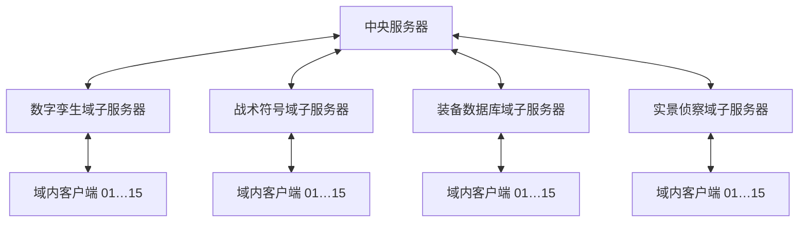
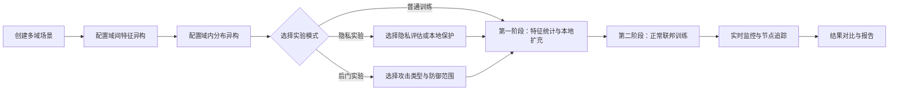
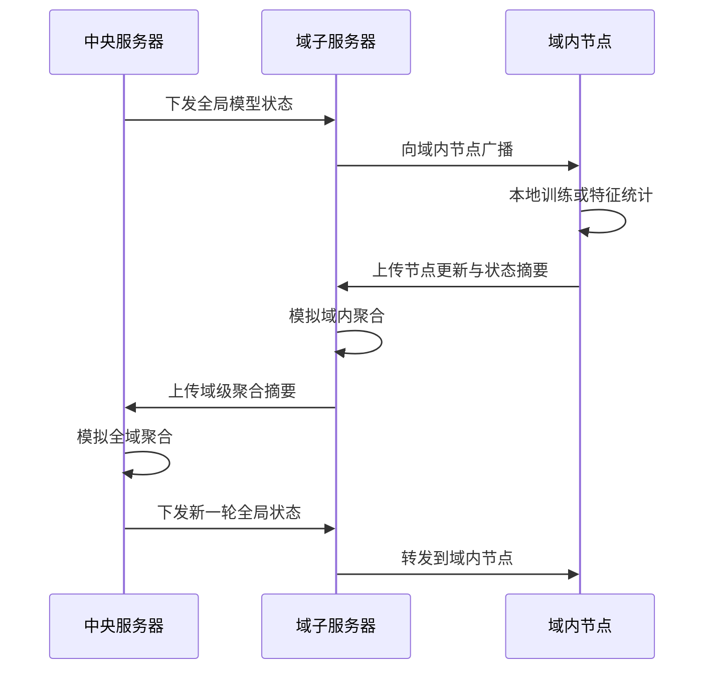
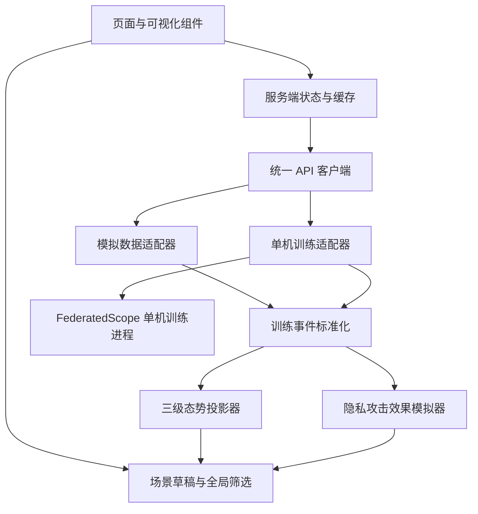

# 跨军事域联邦学习演示平台——前端功能设计

> 历史设计文档：仅用于追溯早期方案，不再作为当前实现依据。当前实现以 [`NEXT_STAGE_REALTIME_INTEGRATION_PLAN.md`](NEXT_STAGE_REALTIME_INTEGRATION_PLAN.md) 为准。

## 1. 文档目的

本文档定义 `frontend/` 前端工程的产品目标、信息架构、页面功能、交互流程、数据模型、接口约定和文件结构，作为后续页面实现与联调验收的依据。

平台用于展示 FederatedScope 单机模拟能力。一个后端进程模拟服务端和多个逻辑客户端，不创建真实分布式客户端，不连接真实军事网络，也不使用真实敏感数据。

## 2. 核心场景

系统模拟多个军事域协同训练一个联合模型。前端以“汇聚全域信息、形成统一认知、支撑智能协同”为核心叙事。这里的“汇聚”是对各域训练结果、统计摘要、状态和风险的统一呈现，不代表集中上传各节点原始数据。

每个域包含一个模拟域子服务器和 15 个模拟节点，并同时存在两层异构：

1. 域间特征异构：由跨域数据集的四个原始域决定，只做统计和对比展示，用户不能修改偏移强度。
2. 域内分布异构：同一域内 15 个客户端的样本量和类别比例不均衡，只通过全局狄利克雷参数 `alpha` 调节。

默认四域与后端 OfficeHome 域键保持显式映射：

| 后端域键 | 前端展示名 | 展示语义 |
| --- | --- | --- |
| `Art` | 数字孪生域 | 仿真建模、三维渲染和虚拟环境生成的装备及任务场景数据 |
| `Clipart` | 战术符号域 | 战术图标、态势标绘和示意图等符号化数据 |
| `Product` | 装备数据库域 | 装备档案库、技术手册或标准流程提供的规范化装备图像 |
| `Real_World` | 实景侦察域 | 无人机、地面智能体等平台在真实任务环境中采集的现场图像 |

前端需要把“两层异构”作为首页视觉背景和所有实验页面的共同上下文，而不是只显示一组普通训练曲线。

### 2.1 全域信息汇聚到智能协同

页面叙事分为四层：

1. 全域感知：汇总各域、各节点的数据特征、分布和运行状态。
2. 分层汇聚：域内节点先汇聚到域子服务器，再由各域子服务器汇聚到中央服务器。
3. 统一认知：中央视图形成跨域模型状态、异构态势、隐私风险和攻击风险摘要。
4. 智能协同：将新的全局模型状态逐级下发，使所有域和节点进入下一轮协同训练。

首页主标题建议使用“全域信息汇聚 · 跨域智能协同”，副标题说明系统在不汇集原始数据的前提下展示跨域联合学习能力。

### 2.2 三级模拟结构

三级结构只用于前端演示和态势表达：



- 第一级：一个中央服务器，展示全域聚合、全局状态和统一下发。
- 第二级：每个军事域一个域子服务器，展示域内接收、域内聚合、向上上传和向下广播。
- 第三级：每个域内固定 15 个逻辑客户端，展示本地训练、上传进度、风险和防御状态。

后端仍执行现有单机联邦训练，不增加分层聚合实现。前端通过“分层态势投影器”把扁平的客户端训练事件组织成三级展示事件。所有派生出的子服务器聚合结果必须标记为“前端模拟”，不得被解释为后端真实计算结果。

## 3. 产品目标

### 3.1 必须展示的能力

- 多军事域、域内多节点的联邦拓扑。
- 中央服务器、域子服务器、域内节点组成的三级拓扑。
- 域内先聚合、中央再聚合，以及中央逐级下发的动态过程。
- 域间数据模态和特征空间差异。
- 域内样本量与标签分布不均衡。
- 异构解决方案的两阶段过程。
- 客户端上传前的本地隐私保护。
- 隐私风险评估与保护前后对比。
- 后门、标签污染和模型更新污染等攻击模拟。
- 无防御、仅训练阶段防御、双阶段防御的对照。
- 全局、域级和节点级指标联动。
- 节点编号、在线状态、训练状态、通信状态和恶意真值。
- 三类隐私攻击的独立效果面板和保护前后对比。
- 实验配置、启动、暂停、回放、比较和报告导出。

### 3.2 明确不做的内容

- 不实现真实多机通信和真实网络拓扑控制。
- 不接入真实军事数据、坐标、装备编号或任务计划。
- 不展示可直接复用的攻击载荷或敏感操作细节。
- 不在浏览器内执行模型训练；前端只负责配置、控制和展示。
- 不要求后端实现域子服务器或真实分层聚合。

## 4. 实验主流程



每轮训练在三级拓扑中的展示顺序：



动画不能暗示浏览器完成了聚合计算。拓扑上固定显示“展示模拟”标识，详情面板同时给出后端原始轮次与前端派生阶段。

模式约束：

- 隐私实验与后门实验互斥。
- 后门实验不得同时启动隐私攻击插件。
- 防御可分别作用于特征统计阶段和正常训练阶段。
- 单次对照任务可自动串行运行“无防御”和“有防御”两个实验，但二者仍是独立运行记录。

## 5. 信息架构

一级导航建议采用左侧固定导航，顶部显示当前场景、运行状态和全局告警。

| 路由 | 页面 | 核心任务 |
| --- | --- | --- |
| `/overview` | 综合态势 | 观察多域拓扑、异构背景、训练阶段和核心指标 |
| `/scenario-analysis` | 场景与异构分析 | 查看固定域间特征偏移，调节域内狄利克雷参数并检查全部客户端分布 |
| `/experiments/new` | 实验配置 | 选择普通、隐私或后门模式，配置保护与防御 |
| `/experiments/:id/live` | 运行监控 | 查看阶段、轮次、节点上传、过滤决策和指标 |
| `/experiments/:id/privacy` | 隐私攻击效果 | 分别展示三类隐私攻击的模拟结果及保护效果 |
| `/experiments/:id/compare` | 对照分析 | 比较无防御与有防御、保护前与保护后 |
| `/reports` | 实验报告 | 查询历史任务、导出图表和配置摘要 |
| `/settings` | 系统设置 | 设置 API 地址、刷新频率、主题和演示数据源 |

## 6. 页面设计

### 6.1 综合态势页

综合态势页是默认首页，需要在首屏直接解释系统解决的问题。

布局：

1. 顶部任务栏：场景名称、实验模式、运行阶段、当前轮次、运行/暂停按钮。
2. 顶部叙事带：从“全域信息”流向“统一认知”和“智能协同”的摘要动画。
3. 左侧主区域：三级多军事域联邦拓扑图。
4. 右侧摘要区：异构指数、隐私风险、攻击风险、异常节点数量。
5. 底部趋势区：全局准确率、最差域准确率、攻击成功率和有效节点数。

“全域信息汇聚”摘要卡至少包含：已接入域数、在线节点数、域级上传完成率、状态新鲜度、风险事件数和本轮有效信息量。点击任一摘要卡，应联动筛选拓扑、节点表和事件时间线。中央服务器旁增加“统一认知摘要”，用短文本解释当前异构程度、可用域覆盖、主要隐私风险和攻击风险；摘要必须由结构化指标模板生成，不使用真实任务判断或未经验证的自主决策描述。

拓扑视觉：

- 中央服务器固定在画布中心或顶部中心，显示全域聚合进度和全局轮次。
- 第一层为各军事域子服务器，每个域使用不同边框纹理，体现特征空间不同。
- 第二层为域内节点，节点大小映射样本量，环形分段映射类别比例。
- 连线颜色表示当前阶段：中央下发、域内广播、节点上传、域内聚合摘要上传。
- 上行时先点亮“节点 → 域子服务器”，域内节点全部完成后再点亮“域子服务器 → 中央服务器”。
- 下行时先点亮“中央服务器 → 全部域子服务器”，再并行点亮“域子服务器 → 域内节点”。
- 异常节点显示脉冲边框；被过滤节点使用灰色断开线，不直接从图中消失。
- 点击域子服务器后显示域内聚合摘要；点击节点后打开节点详情抽屉。
- 画布提供“显示模拟真值”开关，用于控制恶意节点真实身份是否可见。

中央服务器状态：

- 待机、全域下发、等待域级上传、全域聚合、结果评估、完成、异常。
- 展示已完成域数、总域数、全局轮次、聚合进度和最近事件。

域子服务器状态：

- 待机、接收全局状态、域内广播、等待节点、域内聚合、向上上传、等待全局结果、完成、降级。
- 展示模拟子服务器编号，例如 `DS-01`。
- 展示所属域、域内节点总数、已上传节点数、被过滤节点数和域级进度。
- “降级”表示部分节点失败但仍满足模拟聚合条件，不代表真实网络故障。

节点状态信息：

| 字段 | 示例 | 展示要求 |
| --- | --- | --- |
| 模拟节点编号 | `OH-DT-C03` | 全局唯一，可搜索和复制 |
| 所属域 | `数字孪生域` | 使用域颜色和图标 |
| 运行状态 | `本地训练` | 使用状态图标、文本和颜色 |
| 通信状态 | `上传 68%` | 显示方向、进度和模拟延迟 |
| 当前轮次 | `12 / 50` | 与中央轮次并列显示 |
| 样本量 | `2,480` | 同时显示相对域均值的偏差 |
| 标签分布 | 迷你堆叠环图 | 支持展开查看完整分布 |
| 数据质量 | `82 / 100` | 明确标注为模拟分数 |
| 风险分数 | `0.73` | 仅在攻击或防御实验中显示 |
| 防御结论 | `通过/疑似/过滤` | 与恶意真值分开显示 |
| 恶意真值 | `是/否` | 仅在后门模拟且打开真值开关时显示 |

节点运行状态枚举：

```text
离线 → 待机 → 接收中 → 特征统计/本地训练 → 上传中 → 等待聚合 → 已完成
                         ↘ 异常 / 已过滤 / 失败
```

后门攻击展示必须区分：

- 恶意真值：模拟器预先设定的真实角色，仅用于实验复盘。
- 防御判断：系统根据风险分数给出的“正常、疑似、过滤”结论。
- 判断结果：真阳性、假阳性、真阴性或假阴性。

不能因为节点被标记为恶意就自动显示为已检出，也不能把被误报的正常节点改成恶意节点。隐私攻击中的目标节点是受评估对象，不应显示为恶意节点。

背景风格：

- 深蓝灰色底图、低对比度网格和抽象等高线。
- 使用雷达扫描式渐变强调“跨域协同”，但不使用真实地图或坐标。
- 安全色使用青绿色，观察色使用蓝色，风险色使用琥珀色，阻断色使用红色。
- 避免大面积迷彩、武器剪影和高频动画，保证科研展示的可读性。

### 6.2 场景与异构分析页

场景配置和异构分析使用同一个页面、同一个场景草稿和同一次预览结果。建议路由为 `/scenario-analysis`；旧 `/scenario` 与 `/heterogeneity` 只能重定向，不能继续保留独立配置状态。

页面分为四个区域：

1. 场景摘要：只读显示数据集、四域映射、每域 15 个客户端、总类别数和数据来源。
2. 域内划分参数：只提供全局狄利克雷参数 `alpha`、随机种子、重新预览和确认应用。
3. 域间特征区：展示特征投影、域间距离矩阵和处理前后变化，固定标注“由数据集决定，不可调节”。
4. 域内分布区：逐域展示全部客户端的样本数量、类别计数和类别比例。

配置约束：

- 不提供域名称、特征维度、特征偏移强度、长尾强度、缺失类别比例等编辑项。
- `alpha` 是唯一可修改的域内异构强度；建议使用 `0.05～10` 对数滑块，并提供 `0.1`、`0.3`、`0.5`、`1.0`、`10.0` 快捷值。
- `alpha` 越小，客户端类别越集中；`alpha` 越大，客户端类别比例通常越接近所属域的总体分布。
- 随机种子只控制复现，不表达异构强度；最小样本数是后端有效性约束，不作为用户可调异构项。
- 修改参数只生成待确认预览，不能改变正在运行的实验。

域内分布至少提供：

- 域总览卡：域总样本数、15 个客户端、类别数、客户端最小/最大样本数。
- 客户端样本量图：逐个显示 15 个客户端样本数，并支持切换为域内样本占比。
- 客户端 × 类别热力图：支持绝对计数、客户端内类别比例、类别搜索和横向滚动。
- 客户端明细表：编号、样本数、域内占比、类别覆盖数、缺失类别数、最大类别及占比、标签熵。
- 客户端详情抽屉：列出全部类别的样本数与比例，不能只展示前几个类别。

OfficeHome 包含较多类别，热力图使用连续色阶表示数值，不能尝试为每个类别分配一种颜色。点击柱形、热力图行或表格行时，三者与地图中的客户端节点联动选中。四域可使用页签或折叠组，但必须允许用户核对全部 60 个客户端，不能只展示域级平均数。

`alpha` 预览的对比摘要显示最小/最大客户端样本数、平均类别覆盖率、最大类别占比和标签熵的变化。域间特征图在修改 `alpha` 时保持不变，避免暗示域间偏移可以被配置。

### 6.3 实验配置页

采用分步向导：

1. 选择场景。
2. 选择实验模式。
3. 配置异构解决方案。
4. 配置隐私保护或攻击防御。
5. 配置轮次、客户端采样和训练参数。
6. 校验并启动。

实验模式：

| 模式 | 隐私评估 | 后门攻击 | 本地隐私保护 | 两阶段攻击防御 |
| --- | --- | --- | --- | --- |
| 异构基线 | 关闭 | 关闭 | 可选 | 关闭 |
| 隐私风险评估 | 开启 | 关闭 | 关闭 | 关闭 |
| 隐私保护评估 | 开启 | 关闭 | 开启 | 关闭 |
| 后门攻击模拟 | 关闭 | 开启 | 关闭 | 关闭 |
| 后门防御模拟 | 关闭 | 开启 | 关闭 | 开启 |

前端必须在表单层阻止非法组合，并在提交前再次显示模式摘要。

隐私保护配置：

- 初始裁剪阈值。
- 自适应目标分位数。
- 平滑系数。
- 最小与最大裁剪阈值。
- 噪声强度、隐私预算和失败概率。
- 是否公开保护后的非敏感统计。

攻击配置采用抽象参数：

- 攻击类别：后门注入、标签污染、模型更新污染。
- 攻击节点数量或节点列表。
- 目标类别。
- 注入起始轮次、持续轮次和强度。
- 是否污染第一阶段统计量。

防御配置：

- 特征统计阶段异常过滤开关。
- 正常训练阶段异常过滤开关。
- 最小参与节点数。
- 最低保留比例。
- 固定阈值或自适应阈值。
- 调试信息与决策解释开关。

### 6.4 运行监控页

页面顶部使用阶段进度条展示：

```text
场景初始化 → 特征提取 → 统计上传 → 异常过滤 → 本地扩充 → 联邦训练 → 结果评估
```

主要面板：

- 当前轮次和预计剩余时间。
- 活跃、等待、失败、异常和已过滤节点数量。
- 中央服务器、域子服务器和域内节点的三级状态总览。
- 分层拓扑数据流动画。
- 各域“已上传节点/总节点”、域内模拟聚合进度和域级上传状态。
- 全局、各域和各节点准确率趋势。
- 本地更新范数、裁剪阈值和噪声方差趋势。
- 攻击成功率与干净准确率趋势。
- 第一阶段和第二阶段的防御决策表。
- 可筛选的事件时间线和日志。

防御决策表至少包含：阶段、轮次、域、节点、风险分数、处理结果、解释字段。

运行时间线需要把一个后端训练轮次投影为以下前端子阶段：

```text
中央下发 → 域子服务器接收 → 域内广播 → 节点处理 → 节点上传
→ 域内模拟聚合 → 域级上传 → 全域模拟聚合 → 进入下一轮
```

如果后端只提供轮次级快照，前端按照固定种子和配置的展示时长生成子阶段事件；如果后端提供客户端级事件，则优先使用真实事件时间，只补充子服务器派生状态。

### 6.5 隐私攻击效果页

隐私攻击效果页采用“攻击类型导航 + 效果总览 + 目标详情 + 保护对照”四区布局。三类隐私攻击分别运行和展示，不能将多个攻击结果混成一个综合成功率。

攻击效果应由独立实验记录产生。保护前与保护后对照可以并列展示，但不能在同一次训练中动态切换保护开关，也不能与后门攻击实验合并执行。

共同信息：

- 攻击观察方：模拟为能够看到上传参数或统计摘要的好奇聚合方。
- 目标范围：目标域、目标节点、目标样本数量和目标轮次。
- 数据可见性：明确列出攻击只使用了哪些服务端可见信息。
- 保护状态：未保护或已启用本地隐私保护。
- 结果来源：真实训练结果、前端模拟结果或混合派生结果。

#### 6.6.1 成员关系推断效果

用于模拟判断某个样本是否参与过目标节点训练。

展示组件：

- 成员与非成员得分分布双直方图。
- 阈值滑块及真阳性、假阳性、真阴性、假阴性数量。
- ROC 曲线和精确率—召回率曲线。
- 目标样本表：匿名样本编号、真实成员状态、预测概率、预测结果和是否判断正确。
- 域级和节点级攻击效果热力图。

核心指标：攻击准确率、AUC、精确率、召回率、假阳性率和攻击优势值。保护对照区显示这些指标的下降幅度及模型准确率代价。

#### 6.6.2 属性推断效果

用于模拟根据节点上传信息推断其数据属性。属性名称必须使用合成标签，例如“任务类型 A/B/C”或“环境类别 1/2/3”，不得出现真实敏感属性。

展示组件：

- 真实属性与预测属性混淆矩阵。
- 各属性类别的精确率、召回率和 F1。
- 节点列表：节点编号、所属域、真实属性、预测属性、置信度和结果。
- 各域属性泄露风险雷达图。
- 保护前后置信度分布对比。

核心指标：属性推断准确率、宏平均 F1、最高类别置信度和域间风险差异。

#### 6.6.3 数据重建效果

用于模拟从训练过程中可见的信息恢复目标数据特征。

展示组件：

- 合成参考样本、模拟重建结果和差异热力图三联视图。
- 重建过程时间轴，只显示效果变化，不展示可直接复用的攻击实现步骤。
- 每个目标样本的相似度、结构相似度、峰值信噪比和标签恢复结果。
- 不同目标节点与不同轮次的重建质量矩阵。
- 保护前后的重建图像和质量指标并排对照。

所有图像必须来自合成数据、公开测试数据或经过脱敏的演示素材。若没有可展示图像，则使用抽象特征图和占位缩略图。

#### 6.6.4 隐私攻击效果摘要

页面顶部使用三张卡片分别显示：

| 隐私攻击类别 | 主要效果指标 | 保护有效时的预期趋势 |
| --- | --- | --- |
| 成员关系推断 | AUC、攻击准确率、假阳性率 | AUC 和准确率接近随机基线 |
| 属性推断 | 属性准确率、宏平均 F1、置信度 | 准确率和置信度下降 |
| 数据重建 | 相似度、结构相似度、标签恢复率 | 重建质量和标签恢复率下降 |

摘要必须同时显示模型任务准确率，避免只降低攻击效果却忽略模型可用性损失。

### 6.6 对照分析页

支持以下成对或多组比较：

- 未处理异构与启用异构解决方案。
- 隐私保护前与保护后。
- 无攻击、攻击且无防御、攻击且有防御。
- 仅第二阶段防御与双阶段防御。

推荐布局：

- 顶部选择 2～4 个实验。
- 左侧显示共同场景与配置差异。
- 中部显示同步轮次曲线。
- 右侧显示收益与代价摘要。
- 底部显示域级、节点级下钻表格。

关键对照指标：

| 分类 | 指标 |
| --- | --- |
| 训练效果 | 全局准确率、最差域准确率、域间准确率差距、收敛轮次 |
| 异构改善 | 类别覆盖率、域间特征距离、节点公平性、最差节点准确率 |
| 隐私保护 | 隐私风险得分、评估成功率、裁剪比例、噪声方差、准确率代价 |
| 攻击效果 | 攻击成功率、干净准确率下降、目标类别偏移 |
| 防御效果 | 检出率、误报率、漏报率、过滤节点数、防御后攻击成功率 |
| 系统开销 | 阶段耗时、每轮耗时、上传字节数、有效参与率 |

### 6.7 报告页

报告页支持：

- 按场景、模式、时间和状态筛选实验。
- 固定实验为基准并批量比较。
- 导出 PNG、CSV 和 JSON。
- 生成包含场景、配置、曲线、结论和限制项的 HTML 报告。
- 对敏感字段执行脱敏；报告中只显示抽象域名和逻辑节点编号。

## 7. 全局交互规则

- 选择域或节点后，所有页面的图表保持同一筛选上下文。
- 图例支持点击隐藏、框选和恢复。
- 所有指标必须提供定义提示，避免将攻击成功率、检出率和准确率混淆。
- 实验运行时锁定会改变训练语义的配置；允许修改显示选项。
- 断流后显示“数据暂停”而不是清空图表，恢复连接后补拉缺失轮次。
- 危险操作使用二次确认，但模拟攻击启动不使用夸张警告。
- 动画遵循系统的“减少动态效果”设置。

## 8. 技术选型

推荐技术栈：

| 能力 | 方案 | 用途 |
| --- | --- | --- |
| 应用框架 | React + TypeScript | 组件化页面、类型安全的数据契约 |
| 构建工具 | Vite | 开发服务器、构建和环境变量管理 |
| UI 组件 | Ant Design | 表单、表格、抽屉、步骤条和主题系统 |
| 拓扑画布 | React Flow | 军事域、节点、协调器和通信边的交互拓扑 |
| 统计图表 | Apache ECharts | 散点、热力图、雷达图、曲线和联动分析 |
| 服务端状态 | TanStack Query | 请求缓存、轮询、失效和错误重试 |
| 本地状态 | Zustand | 场景草稿、跨页面筛选和界面偏好 |
| 路由 | React Router | 页面路由和实验详情深链接 |
| 表单校验 | Zod | 场景、实验配置和接口响应校验 |
| 单元测试 | Vitest + Testing Library | 组件、状态和数据转换测试 |
| 端到端测试 | Playwright | 场景创建、实验启动和报告导出流程 |

选型依据：

- React 和 TypeScript 适合构建可复用、强类型的复杂交互组件。
- Vite 提供 React TypeScript 模板和快速开发反馈。
- Ant Design 提供成熟的企业级中后台组件及主题能力。
- React Flow 内置缩放、平移、节点选择、连线和小地图，适合多层联邦拓扑。
- Apache ECharts 能覆盖本项目所需的多类统计图和联动交互。

不在设计阶段锁死精确版本。实施时使用当期稳定版并提交锁文件，避免文档版本与实际依赖漂移。

相关官方文档：

- [React TypeScript 指南](https://react.dev/learn/typescript)
- [Vite 使用指南](https://vite.dev/guide/)
- [Ant Design React 文档](https://ant.design/docs/react/introduce-cn/)
- [React Flow 文档](https://reactflow.dev/learn)
- [Apache ECharts 使用手册](https://echarts.apache.org/handbook/zh/get-started/)
- [TanStack Query React 文档](https://tanstack.com/query/latest/docs/framework/react/overview)
- [React Router 文档](https://reactrouter.com/home)
- [Zod 文档](https://zod.dev/)
- [Playwright 文档](https://playwright.dev/docs/intro)

## 9. 前端系统架构



前端必须支持两种数据源：

1. 演示模式：使用固定种子的模拟数据，无需启动 Python 服务即可完整浏览页面。
2. 联调模式：连接单机训练 API，接收真实配置、轮次指标和防御决策。

通过同一套 TypeScript 接口屏蔽两种数据源差异，页面组件不得直接导入模拟数据。

三级态势投影规则：

1. 根据场景定义把逻辑节点分组到各军事域。
2. 为每个域生成一个只存在于前端的域子服务器。
3. 根据域内节点状态推导子服务器状态和进度。
4. 根据所有子服务器状态推导中央服务器展示状态。
5. 域级指标可使用节点样本量加权生成展示摘要，但必须附带 `simulated: true`。
6. 投影结果只能用于界面，不得反写训练配置、聚合参数或模型状态。
7. 相同实验、相同轮次和相同随机种子必须生成一致的模拟时间和状态。

## 10. 核心数据模型

```ts
type SecurityMode = 'none' | 'privacy' | 'backdoor';
type RunStatus = 'draft' | 'queued' | 'running' | 'paused' |
  'completed' | 'failed' | 'cancelled';
type TrainingStage = 'initializing' | 'feature_extraction' |
  'statistics_upload' | 'statistics_filtering' | 'local_expansion' |
  'federated_training' | 'evaluation';
type NodeOperationalStatus = 'offline' | 'idle' | 'receiving' |
  'feature_statistics' | 'local_training' | 'uploading' |
  'waiting_aggregation' | 'completed' | 'anomalous' |
  'filtered' | 'failed';
type ServerOperationalStatus = 'idle' | 'broadcasting' |
  'waiting_children' | 'aggregating' | 'uploading' |
  'waiting_parent' | 'evaluating' | 'completed' | 'degraded' | 'failed';
type DefenseAssessment = 'normal' | 'suspected' | 'filtered' | 'unknown';
type PrivacyAttackKind = 'membership' | 'property' | 'reconstruction';

interface CentralServer {
  id: string;
  displayName: string;
  status: ServerOperationalStatus;
  currentRound: number;
  completedDomainCount: number;
  totalDomainCount: number;
  aggregationProgress: number;
  simulated: true;
}

interface DomainServer {
  id: string;
  domainId: string;
  displayName: string;
  status: ServerOperationalStatus;
  uploadedNodeCount: number;
  totalNodeCount: number;
  filteredNodeCount: number;
  aggregationProgress: number;
  simulated: true;
}

interface MilitaryDomain {
  id: string;
  backendKey: 'Art' | 'Clipart' | 'Product' | 'Real_World';
  name: string;
  featureStatistics: Readonly<Record<string, number>>;
  server: DomainServer;
  nodes: MilitaryNode[];
}

interface MilitaryNode {
  id: string;
  simulatedNodeCode: string;
  domainId: string;
  status: NodeOperationalStatus;
  communicationProgress: number;
  simulatedLatencyMs: number;
  currentRound: number;
  sampleCount: number;
  labelHistogram: Record<string, number>;
  labelProportions: Record<string, number>;
  coveredClassCount: number;
  missingClassCount: number;
  dominantClassRatio: number;
  labelEntropy: number;
  qualityScore: number;
  maliciousGroundTruth: boolean;
  defenseAssessment: DefenseAssessment;
  riskScore?: number;
  lastEventAt: string;
}

interface Scenario {
  id: string;
  name: string;
  seed: number;
  dirichletAlpha: number;
  centralServer: CentralServer;
  domains: MilitaryDomain[];
  createdAt: string;
  updatedAt: string;
}

interface ExperimentConfig {
  scenarioId: string;
  securityMode: SecurityMode;
  totalRounds: number;
  sampledClients: number;
  heterogeneityEnabled: boolean;
  privacyProtection?: PrivacyProtectionConfig;
  attack?: AttackSimulationConfig;
  defense?: DefenseConfig;
}

interface RoundSnapshot {
  experimentId: string;
  stage: TrainingStage;
  round: number;
  globalMetrics: Record<string, number>;
  domainMetrics: Record<string, Record<string, number>>;
  nodeMetrics: Record<string, Record<string, number>>;
  hierarchy: HierarchySnapshot;
  privacyResults?: PrivacyAttackResult[];
  decisions: DefenseDecision[];
  timestamp: string;
}

interface HierarchySnapshot {
  centralServer: CentralServer;
  domainServers: DomainServer[];
  nodes: MilitaryNode[];
  displayPhase: 'central_downlink' | 'domain_broadcast' | 'node_processing' |
    'node_uplink' | 'domain_aggregation' | 'domain_uplink' |
    'central_aggregation';
  simulated: true;
}

interface DefenseDecision {
  stage: 'statistics' | 'training';
  round: number;
  domainId: string;
  nodeId: string;
  riskScore: number;
  action: 'accepted' | 'filtered' | 'fallback';
  reasons: string[];
}

interface PrivacyAttackResultBase {
  kind: PrivacyAttackKind;
  experimentId: string;
  targetDomainId: string;
  targetNodeIds: string[];
  protected: boolean;
  resultSource: 'backend' | 'frontend_simulation' | 'hybrid';
  simulated: boolean;
}

interface MembershipSampleDecision {
  sampleId: string;
  memberGroundTruth: boolean;
  membershipProbability: number;
  predictedMember: boolean;
  correct: boolean;
}

interface PropertyNodePrediction {
  nodeId: string;
  propertyGroundTruth: string;
  predictedProperty: string;
  confidence: number;
  correct: boolean;
}

interface ReconstructionTarget {
  targetId: string;
  referenceAsset?: string;
  reconstructedAsset?: string;
  differenceAsset?: string;
  similarity: number;
  structuralSimilarity: number;
  peakSignalToNoiseRatio: number;
  labelRecovered: boolean;
}

interface MembershipAttackResult extends PrivacyAttackResultBase {
  kind: 'membership';
  auc: number;
  accuracy: number;
  precision: number;
  recall: number;
  falsePositiveRate: number;
  memberScores: number[];
  nonMemberScores: number[];
  sampleDecisions: MembershipSampleDecision[];
}

interface PropertyAttackResult extends PrivacyAttackResultBase {
  kind: 'property';
  accuracy: number;
  macroF1: number;
  labels: string[];
  confusionMatrix: number[][];
  nodePredictions: PropertyNodePrediction[];
}

interface ReconstructionAttackResult extends PrivacyAttackResultBase {
  kind: 'reconstruction';
  targets: ReconstructionTarget[];
  meanSimilarity: number;
  meanStructuralSimilarity: number;
  labelRecoveryRate: number;
}

type PrivacyAttackResult = MembershipAttackResult |
  PropertyAttackResult | ReconstructionAttackResult;
```

## 11. API 约定

前端先按以下接口设计，后端可以逐步实现：

| 方法 | 路径 | 用途 |
| --- | --- | --- |
| `GET` | `/api/capabilities` | 获取支持的模式、攻击类别、指标和参数范围 |
| `GET` | `/api/scenarios` | 查询场景列表 |
| `POST` | `/api/scenarios` | 创建场景 |
| `GET` | `/api/scenarios/:id` | 获取场景详情 |
| `PUT` | `/api/scenarios/:id` | 更新场景 |
| `POST` | `/api/scenarios/preview` | 按 `alpha` 和随机种子生成四域客户端划分预览 |
| `POST` | `/api/experiments` | 创建并启动实验 |
| `GET` | `/api/experiments` | 查询实验记录 |
| `GET` | `/api/experiments/:id` | 获取实验状态和配置 |
| `POST` | `/api/experiments/:id/pause` | 暂停实验 |
| `POST` | `/api/experiments/:id/resume` | 恢复实验 |
| `POST` | `/api/experiments/:id/cancel` | 取消实验 |
| `GET` | `/api/experiments/:id/rounds` | 分页获取轮次快照 |
| `GET` | `/api/experiments/:id/events` | 使用 SSE 推送阶段、轮次和日志事件 |
| `GET` | `/api/experiments/:id/report` | 获取报告数据 |

三级结构不增加子服务器 API。前端不得请求 `/api/domain-servers` 或把域内聚合结果提交给后端。域子服务器、域内聚合进度、中央二次聚合进度和逐级下发事件均由前端态势投影器生成。

场景接口不接受域间特征偏移强度。场景创建或预览时，前端只提交数据集、四个后端域键、每域客户端数、全局 `alpha` 和随机种子；后端按域返回全部客户端的 `sampleCount` 与 `labelHistogram`。前端校验每个客户端的类别计数之和等于样本数、每个域的客户端样本数之和等于该域训练样本总数，再派生类别比例和分布摘要。

隐私攻击效果按渐进方式接入：后端有结构化结果时直接展示；只有日志时由适配器解析为统一结果；没有后端结果时使用带 `frontend_simulation` 标记的固定种子模拟数据。

接口响应统一包含：

```ts
interface ApiEnvelope<T> {
  data: T;
  requestId: string;
  timestamp: string;
  error?: { code: string; message: string; details?: unknown };
}
```

## 12. 组件清单

基础组件：

- `AppShell`：导航、顶部状态栏和内容区域。
- `MetricCard`：指标、趋势、阈值状态和定义提示。
- `StatusBadge`：节点、实验和训练阶段状态。
- `ConfigSummary`：实验启动前的只读摘要。
- `EmptyState`、`ErrorState`、`LoadingState`：统一异步状态。

场景、异构与拓扑组件：

- `FederationTopology`：中央服务器、域子服务器和域内节点三级拓扑。
- `CentralServerNode`：全域聚合和下发状态。
- `DomainServerNode`：域内接收、聚合、上传和广播状态。
- `MilitaryClientNode`：编号、状态、样本量、风险和角色信息。
- `HierarchyFlowAnimator`：上行聚合和下行广播的分层动画。
- `CommunicationEdge`：按阶段、方向和状态变化的通信边。
- `GroundTruthToggle`：控制是否展示恶意节点模拟真值。
- `DomainAggregationSummary`：域级模拟聚合摘要。
- `CentralServerInspector`、`DomainServerInspector`、`ClientInspector`：三级详情抽屉。
- `NodeStatusLegend`：节点状态、真值和防御判断图例。
- `ScenarioAnalysisWorkbench`：共享场景草稿、预览结果和图表筛选状态。
- `DirichletAlphaControl`：唯一可调域内异构强度，使用对数尺度。
- `FixedDomainShiftPanel`：只读域间特征统计与不可调提示。
- `DomainDistributionOverview`：四域样本与类别摘要。
- `ClientSampleCountChart`：逐域显示 15 个客户端样本数量。
- `ClientClassHeatmap`：客户端 × 类别的数量或比例热力图。
- `ClientDistributionTable`：完整客户端分布指标表。
- `ClientDistributionDrawer`：展示选中客户端的全部类别明细。
- `FeatureProjectionChart`。
- `DomainDistanceHeatmap`。
- `BeforeAfterSwitch`。

安全实验组件：

- `SecurityModeSelector`。
- `PrivacyProtectionForm`。
- `AttackSimulationForm`。
- `DefenseStageSelector`。
- `DefenseDecisionTable`。
- `RiskScoreDistribution`。
- `AttackDefenseComparison`。
- `PrivacyAttackNavigator`：三类隐私攻击切换。
- `MembershipEffectPanel`：得分分布、阈值、曲线和样本决策。
- `PropertyEffectPanel`：混淆矩阵、节点预测和类别指标。
- `ReconstructionEffectPanel`：参考、重建、差异和质量指标。
- `PrivacyProtectionComparison`：保护前后攻击效果与模型代价。
- `ResultSourceBadge`：后端结果、前端模拟或混合派生标识。

训练监控组件：

- `TrainingStageTimeline`。
- `RoundProgress`。
- `AccuracyTrendChart`。
- `PrivacyTrendChart`。
- `AttackTrendChart`。
- `ClientUpdateNormChart`。
- `EventTimeline`。
- `HierarchyStageTimeline`。
- `DomainUploadProgress`。
- `NodeStatusTable`。

## 13. 建议文件结构

```text
frontend/
├── FRONTEND_DESIGN.md
├── README.md
├── package.json
├── pnpm-lock.yaml
├── index.html
├── vite.config.ts
├── tsconfig.json
├── tsconfig.app.json
├── tsconfig.node.json
├── eslint.config.js
├── public/
│   └── icons/
├── src/
│   ├── main.tsx
│   ├── app/
│   │   ├── App.tsx
│   │   ├── router.tsx
│   │   ├── providers.tsx
│   │   └── theme.ts
│   ├── api/
│   │   ├── client.ts
│   │   ├── capabilities.ts
│   │   ├── scenarios.ts
│   │   ├── experiments.ts
│   │   └── eventStream.ts
│   ├── components/
│   │   ├── layout/
│   │   ├── common/
│   │   ├── topology/
│   │   │   ├── FederationTopology.tsx
│   │   │   ├── CentralServerNode.tsx
│   │   │   ├── DomainServerNode.tsx
│   │   │   ├── MilitaryClientNode.tsx
│   │   │   ├── CommunicationEdge.tsx
│   │   │   ├── HierarchyFlowAnimator.tsx
│   │   │   ├── GroundTruthToggle.tsx
│   │   │   └── NodeStatusLegend.tsx
│   │   ├── charts/
│   │   ├── scenarioAnalysis/
│   │   ├── security/
│   │   │   ├── MembershipEffectPanel.tsx
│   │   │   ├── PropertyEffectPanel.tsx
│   │   │   ├── ReconstructionEffectPanel.tsx
│   │   │   ├── PrivacyProtectionComparison.tsx
│   │   │   └── DefenseDecisionTable.tsx
│   │   └── training/
│   ├── features/
│   │   ├── overview/
│   │   ├── scenarioAnalysis/
│   │   ├── experimentBuilder/
│   │   ├── liveMonitor/
│   │   ├── privacyEffects/
│   │   ├── comparison/
│   │   └── reports/
│   ├── hooks/
│   ├── mock/
│   │   ├── fixtures/
│   │   ├── generators/
│   │   │   ├── hierarchy.ts
│   │   │   ├── nodeStatuses.ts
│   │   │   ├── membershipEffects.ts
│   │   │   ├── propertyEffects.ts
│   │   │   └── reconstructionEffects.ts
│   │   └── handlers.ts
│   ├── stores/
│   ├── types/
│   │   ├── scenario.ts
│   │   ├── hierarchy.ts
│   │   ├── experiment.ts
│   │   └── privacy.ts
│   ├── utils/
│   │   ├── hierarchyProjection.ts
│   │   ├── classDistribution.ts
│   │   ├── defenseConfusion.ts
│   │   └── metricFormatters.ts
│   └── styles/
├── tests/
│   ├── unit/
│   └── e2e/
└── playwright.config.ts
```

文件职责：

- `api/` 只负责网络与数据源适配。
- `features/` 按页面业务组织状态和容器组件。
- `components/` 保存可跨页面复用的展示组件。
- `mock/` 生成确定性的多域、异构、攻防演示数据。
- `hierarchyProjection.ts` 把扁平客户端事件投影为三级展示状态，不参与训练计算。
- `privacyEffects/` 分别承载三类隐私攻击效果页面和保护前后对照。
- `types/` 维护与 Python 后端一致的数据契约。
- `tests/e2e/` 覆盖从场景与异构预览到报告导出的主流程。

## 14. 模拟数据设计

演示模式至少提供以下数据集：

1. `officehome-alpha-10`：固定四域特征，域内客户端类别分布接近均衡。
2. `officehome-alpha-03`：固定四域特征，域内分布中等不均衡。
3. `officehome-alpha-01`：固定四域特征，域内客户端类别集中且缺类更明显。
4. `hierarchical-flow`：完整播放中央、域子服务器和域内节点的上行与下行状态。
5. `membership-privacy`：生成成员与非成员得分、曲线和样本判断结果。
6. `property-privacy`：生成合成属性、预测置信度和混淆矩阵。
7. `reconstruction-privacy`：生成合成参考样本、重建结果和质量指标。
8. `privacy-protected-comparison`：为三类隐私攻击生成保护前后成对结果。
9. `backdoor-no-defense`：恶意节点攻击成功率随轮次上升，并保留真值标签。
10. `backdoor-two-stage-defense`：两个阶段分别产生检测结论和混淆结果。

所有模拟数据由固定随机种子生成，使截图、测试和演示可以重复。

节点状态生成要求：

- 每个节点拥有稳定的模拟编号、所属域、初始延迟和状态时间线。
- 同一域节点上传完成后，才进入该域子服务器的模拟聚合动画。
- 所有满足条件的域子服务器完成上传后，才进入中央模拟聚合动画。
- 允许注入离线、延迟、失败和过滤事件，用于展示降级状态。
- 后门场景同时生成恶意真值和防御判断，支持真阳性、假阳性、真阴性和假阴性四种情况。
- 隐私场景不生成恶意客户端真值，只生成攻击观察方、目标节点和攻击效果。

## 15. 视觉规范

### 15.1 色彩

- 页面背景：`#08111F`。
- 面板背景：`#101D2E`。
- 主色：`#38BDF8`。
- 安全状态：`#2DD4BF`。
- 观察状态：`#60A5FA`。
- 风险状态：`#F59E0B`。
- 阻断状态：`#F43F5E`。
- 次要文字：`#94A3B8`。

军事域颜色不能直接承担安全语义；域颜色和风险颜色需要通过形状、纹理和图例共同区分。

### 15.2 字体与密度

- 中文正文优先系统无衬线字体。
- 指标数字使用等宽数字特性。
- 默认面向 1440px 及以上桌面屏幕，最低支持 1280px。
- 表格使用紧凑模式，图表保留足够留白。

### 15.3 三级拓扑语义

| 层级 | 固定形状 | 状态表达 | 角色信息 |
| --- | --- | --- | --- |
| 中央服务器 | 六边形或双环圆 | 外环进度与状态文字 | 不显示恶意属性 |
| 域子服务器 | 圆角矩形 | 顶部状态条与域内进度 | 固定显示“前端模拟” |
| 域内节点 | 圆形 | 边框、状态图标与通信进度 | 后门实验可显示真值和防御判断 |

- 上行边使用实线箭头，下行边使用虚线箭头；同一时刻只突出当前方向。
- 域子服务器聚合和中央聚合均显示“展示模拟”角标。
- 恶意真值使用角色图标，防御判断使用盾牌图标，二者不得共用同一颜色或标签。
- 真值关闭时不通过颜色、排序、提示文字或动画泄露恶意节点身份。
- 节点离线、失败、被过滤是不同状态，分别使用断线、故障和阻断图标。
- 拓扑收起某个域时，域子服务器保留域内节点状态计数，避免状态信息丢失。

### 15.4 可访问性

- 正文和背景对比度符合 WCAG AA。
- 风险状态不能只靠颜色表达。
- 拓扑节点和图表提供键盘焦点与文本摘要。
- 动画可暂停，并支持减少动态效果。

## 16. 性能要求

- 首屏模拟数据加载后 2 秒内可交互。
- 拓扑支持至少 8 个域、每域 60 个逻辑节点。
- 曲线默认只渲染可视范围，长实验采用抽样或数据缩减。
- SSE 事件按帧批量写入状态，避免每条日志触发整页渲染。
- 大型热力图和散点图使用增量或渐进渲染。
- 页面切换保留当前域、节点和实验筛选上下文。
- 节点表使用虚拟滚动；拓扑缩放到低倍率时自动折叠节点，只保留域级状态汇总。
- 高频上传事件合并为不高于每秒 10 次的视觉更新，事件原始时间仍保留在详情中。
- 暂停或切到后台标签页时停止非必要动画，恢复后直接投影到最新状态。

## 17. 测试与验收

### 17.1 功能验收

- 场景配置与异构分析只有一个页面、一个导航入口和一份预览状态。
- 后端四域键固定映射到四个前端域名，且每域包含 15 个客户端。
- 域间特征偏移只能查看，页面不能修改或提交偏移强度。
- 域内分布不均只通过全局狄利克雷参数 `alpha` 调节。
- 能逐域查看全部客户端的样本数、域内占比、类别计数、类别比例和分布摘要。
- 首页能同时看出域间差异、节点样本量和类别比例。
- 能启动普通、隐私和后门三类单机模拟。
- 非法的隐私与后门组合无法提交。
- 能查看第一阶段和第二阶段的独立防御结果。
- 能比较无防御和有防御实验。
- 能下钻到域和节点并保持图表联动。
- 演示模式在无 Python 服务时仍可完整使用。
- 每个域恰好生成一个域子服务器，中央服务器能够连接全部域子服务器。
- 上行演示遵循“节点上传—域内模拟聚合—域级上传—全域模拟聚合”的顺序。
- 下行演示遵循“中央下发—域子服务器接收—域内广播”的顺序。
- 能查看中央服务器、域子服务器和节点各自的编号、状态、进度与最近事件。
- 后门实验能通过开关显示或隐藏恶意真值，并分别展示防御判断及真阳性、假阳性、真阴性、假阴性。
- 隐私实验不会把目标节点标记为恶意节点，也不会同时启动后门攻击。
- 成员关系推断、属性推断和数据重建均有独立效果页面、独立指标和保护前后对照。
- 所有域子服务器状态和聚合结果均标记为“前端模拟”，前端不会调用或伪造后端分层聚合接口。
- 相同场景、轮次和随机种子能够复现相同的节点时间线与三级状态。

### 17.2 自动化测试

- 数据契约解析与错误响应测试。
- 场景与异构页面的 `alpha` 范围、预览确认和旧路由重定向测试。
- 域间特征偏移只读且不会进入请求体的测试。
- 客户端样本计数、类别计数和比例守恒测试。
- 安全模式互斥测试。
- 拓扑节点选择与图表联动测试。
- SSE 断流和重连测试。
- 实验对照和报告导出端到端测试。
- 三级态势投影器的确定性、状态转换和异常降级测试。
- 节点上传未完成时不得提前进入域级上传的时序测试。
- 恶意真值开关的隐藏测试，确保关闭后不在 DOM、提示或无障碍文本中泄露真值。
- 恶意真值与防御判断的混淆统计测试。
- 三类隐私攻击结果的数据契约、空状态和保护对照测试。
- 隐私与后门模式互斥的接口提交测试。
- 前端投影状态只读测试，确保不会产生域子服务器写请求或修改训练配置。

## 18. 实施阶段

### 第一阶段：可交互原型

- 搭建前端工程、主题和路由。
- 使用模拟数据完成综合态势、场景与异构分析和实验配置。
- 实现全局 `alpha` 控件、四域 60 客户端样本量图和客户端 × 类别热力图。
- 完成中央服务器、域子服务器、域内节点三级拓扑与分层动画。
- 完成节点编号、节点状态、域级状态、真值开关和核心图表。

### 第二阶段：实验闭环

- 完成运行监控、对照分析和报告页。
- 增加普通、隐私和后门三类模拟数据。
- 完成三类隐私攻击效果页、保护前后对照和结果来源标识。
- 完成后门恶意真值、防御判断和混淆结果展示。
- 完成模式约束和自动化测试。

### 第三阶段：单机训练联调

- 接入能力查询、场景预览、实验创建和状态接口。
- 接入 SSE 实时事件。
- 将配置表单映射到现有单机配置。
- 校验前端指标与训练日志的一致性。

## 19. 前后端边界与后续配合

前端实现不要求立即修改训练核心，但完整联调需要增加一个轻量 API 层：

- 将场景表单转换为单机训练配置。
- 在子进程或任务队列中启动训练。
- 将训练日志转换为结构化轮次事件。
- 提供阶段、域、节点、隐私和攻防指标。
- 支持停止任务并保留已产生的结果。
- 对输出目录和配置字段执行白名单校验。

API 层必须保持单机模拟边界，不暴露真实分布式客户端注册或网络控制能力。

以下能力明确由前端承担，不纳入后端改造：

- 生成域子服务器和中央服务器的展示对象。
- 将扁平客户端事件投影为三级状态与分层动画。
- 生成域内聚合、域级上传、中央聚合和逐级下发的模拟进度。
- 在后端缺少结构化隐私评估结果时生成可复现的效果演示数据。

后端只需维持现有单机训练语义，并尽可能提供实验配置、逻辑节点、训练阶段、轮次指标、节点指标和安全判断。前端派生结果不得作为训练输入，也不得写回后端结果目录。
