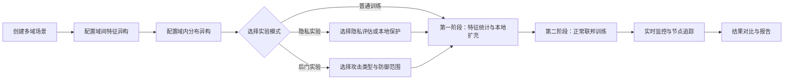
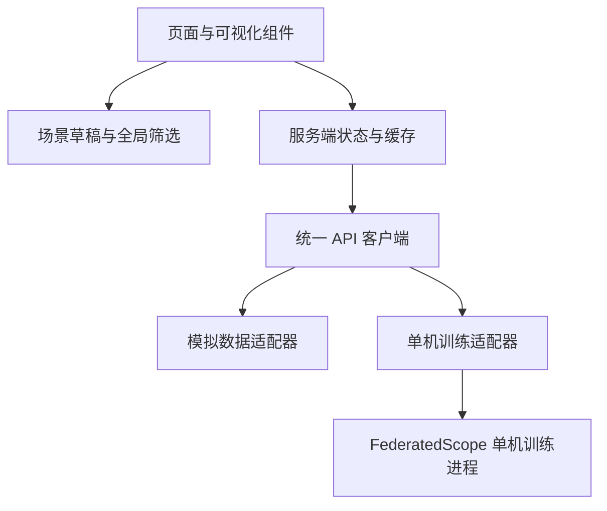

# 跨军事域联邦学习演示平台——前端功能设计

## 1. 文档目的

本文档定义 `frontend/` 前端工程的产品目标、信息架构、页面功能、交互流程、数据模型、接口约定和文件结构，作为后续页面实现与联调验收的依据。

平台用于展示 FederatedScope 单机模拟能力。一个后端进程模拟服务端和多个逻辑客户端，不创建真实分布式客户端，不连接真实军事网络，也不使用真实敏感数据。

## 2. 核心场景

系统模拟多个军事域协同训练一个联合模型。每个域包含多个军事节点，并同时存在两层异构：

1. 域间特征异构：不同域采集的数据模态、特征维度、采样频率和语义空间不同。
2. 域内分布异构：同一域内不同节点的样本量、类别比例、质量和时间分布不均衡。

建议默认演示四类抽象域，名称和数据均为合成示例：

| 军事域 | 示例数据 | 域间差异 | 域内差异 |
| --- | --- | --- | --- |
| 态势感知域 | 图像与目标特征 | 图像特征维度高 | 各节点目标类别、天气和视角不同 |
| 电磁感知域 | 频谱与时序特征 | 时序长度、采样率不同 | 各节点信号类型和信噪比分布不同 |
| 无人平台域 | 遥测与视觉特征 | 多传感器组合不同 | 各平台任务区域和样本量不同 |
| 指挥决策域 | 文本与结构化特征 | 语义特征和表格特征并存 | 各节点事件类别和数据新鲜度不同 |

前端需要把“两层异构”作为首页视觉背景和所有实验页面的共同上下文，而不是只显示一组普通训练曲线。

## 3. 产品目标

### 3.1 必须展示的能力

- 多军事域、域内多节点的联邦拓扑。
- 域间数据模态和特征空间差异。
- 域内样本量与标签分布不均衡。
- 异构解决方案的两阶段过程。
- 客户端上传前的本地隐私保护。
- 隐私风险评估与保护前后对比。
- 后门、标签污染和模型更新污染等攻击模拟。
- 无防御、仅训练阶段防御、双阶段防御的对照。
- 全局、域级和节点级指标联动。
- 实验配置、启动、暂停、回放、比较和报告导出。

### 3.2 明确不做的内容

- 不实现真实多机通信和真实网络拓扑控制。
- 不接入真实军事数据、坐标、装备编号或任务计划。
- 不展示可直接复用的攻击载荷或敏感操作细节。
- 不在浏览器内执行模型训练；前端只负责配置、控制和展示。

## 4. 实验主流程



模式约束：

- 隐私实验与后门实验互斥。
- 后门实验不得同时启动隐私攻击插件。
- 防御可分别作用于特征统计阶段和正常训练阶段。
- 单次对照任务可自动串行运行“无防御”和“有防御”两个实验，但二者仍是独立运行记录。

## 5. 信息架构

一级导航建议采用左侧固定导航，顶部显示当前场景、运行状态和全局告警。

| 路由 | 页面 | 核心任务 |
| --- | --- | --- |
| `/overview` | 综合态势 | 观察多域拓扑、异构背景、训练阶段和核心指标 |
| `/scenario` | 场景编排 | 创建域、节点、数据分布和特征差异 |
| `/heterogeneity` | 异构分析 | 对比域间特征与域内分布，查看处理前后变化 |
| `/experiments/new` | 实验配置 | 选择普通、隐私或后门模式，配置保护与防御 |
| `/experiments/:id/live` | 运行监控 | 查看阶段、轮次、节点上传、过滤决策和指标 |
| `/experiments/:id/compare` | 对照分析 | 比较无防御与有防御、保护前与保护后 |
| `/reports` | 实验报告 | 查询历史任务、导出图表和配置摘要 |
| `/settings` | 系统设置 | 设置 API 地址、刷新频率、主题和演示数据源 |

## 6. 页面设计

### 6.1 综合态势页

综合态势页是默认首页，需要在首屏直接解释系统解决的问题。

布局：

1. 顶部任务栏：场景名称、实验模式、运行阶段、当前轮次、运行/暂停按钮。
2. 左侧主区域：多军事域联邦拓扑图。
3. 右侧摘要区：异构指数、隐私风险、攻击风险、异常节点数量。
4. 底部趋势区：全局准确率、最差域准确率、攻击成功率和有效节点数。

拓扑视觉：

- 中心节点表示联邦协调器。
- 第一层为军事域，每个域使用不同边框纹理，体现特征空间不同。
- 第二层为域内节点，节点大小映射样本量，环形分段映射类别比例。
- 连线颜色表示当前阶段：统计上传、结果下发、模型上传、模型下发。
- 异常节点显示脉冲边框；被过滤节点使用灰色断开线，不直接从图中消失。
- 点击域后联动右侧图表；点击节点后打开节点详情抽屉。

背景风格：

- 深蓝灰色底图、低对比度网格和抽象等高线。
- 使用雷达扫描式渐变强调“跨域协同”，但不使用真实地图或坐标。
- 安全色使用青绿色，观察色使用蓝色，风险色使用琥珀色，阻断色使用红色。
- 避免大面积迷彩、武器剪影和高频动画，保证科研展示的可读性。

### 6.2 场景编排页

采用“三栏编辑器”：域列表、画布、属性面板。

域级配置：

- 域名称、抽象图标和颜色。
- 数据模态：图像、时序、文本、结构化或混合。
- 原始特征维度、统一表示维度、特征偏移强度。
- 域样本总量、类别集合、质量等级。

节点级配置：

- 节点数量，可在 2～60 范围内模拟。
- 每个节点样本量或长尾程度。
- 标签分布浓度参数。
- 缺失类别比例、噪声比例、时间漂移程度。
- 是否为攻击节点；攻击节点只能在后门实验中生效。

快捷预设：

- 轻度异构：域间差异小、域内标签较均衡。
- 中度异构：特征偏移明显、样本量呈长尾。
- 重度异构：多模态差异显著、节点缺类严重。
- 攻防演示：四个域、每域四个节点、一个攻击节点。

编辑器需要提供随机种子、重置、复制域、批量生成节点、导入和导出场景 JSON。

### 6.3 异构分析页

该页面需要同时呈现域间和域内差异。

域间特征异构：

- 特征投影散点图：显示统一处理前后的域间聚类变化。
- 域间距离矩阵：热力图显示任意两域之间的特征距离。
- 特征维度与模态卡片：展示各域原始维度、统一后维度和缺失字段。
- 域间偏移雷达图：均值偏移、协方差偏移、类间分离度和跨域一致性。

域内分布异构：

- 节点 × 类别堆叠条形图。
- 节点 × 类别样本数热力图。
- 节点样本量长尾图。
- 标签熵、最大类别占比和缺失类别数量。

处理效果：

- “处理前/处理后”切换。
- 类别覆盖率变化。
- 域间距离变化。
- 最差节点与最差域准确率变化。
- 鼠标悬停时关联高亮拓扑中的对应域或节点。

### 6.4 实验配置页

采用分步向导：

1. 选择场景。
2. 选择实验模式。
3. 配置异构解决方案。
4. 配置隐私保护或攻击防御。
5. 配置轮次、客户端采样和训练参数。
6. 校验并启动。

实验模式：

| 模式 | 隐私评估 | 后门攻击 | 本地隐私保护 | 两阶段攻击防御 |
| --- | --- | --- | --- | --- |
| 异构基线 | 关闭 | 关闭 | 可选 | 关闭 |
| 隐私风险评估 | 开启 | 关闭 | 关闭 | 关闭 |
| 隐私保护评估 | 开启 | 关闭 | 开启 | 关闭 |
| 后门攻击模拟 | 关闭 | 开启 | 关闭 | 关闭 |
| 后门防御模拟 | 关闭 | 开启 | 关闭 | 开启 |

前端必须在表单层阻止非法组合，并在提交前再次显示模式摘要。

隐私保护配置：

- 初始裁剪阈值。
- 自适应目标分位数。
- 平滑系数。
- 最小与最大裁剪阈值。
- 噪声强度、隐私预算和失败概率。
- 是否公开保护后的非敏感统计。

攻击配置采用抽象参数：

- 攻击类别：后门注入、标签污染、模型更新污染。
- 攻击节点数量或节点列表。
- 目标类别。
- 注入起始轮次、持续轮次和强度。
- 是否污染第一阶段统计量。

防御配置：

- 特征统计阶段异常过滤开关。
- 正常训练阶段异常过滤开关。
- 最小参与节点数。
- 最低保留比例。
- 固定阈值或自适应阈值。
- 调试信息与决策解释开关。

### 6.5 运行监控页

页面顶部使用阶段进度条展示：

```text
场景初始化 → 特征提取 → 统计上传 → 异常过滤 → 本地扩充 → 联邦训练 → 结果评估
```

主要面板：

- 当前轮次和预计剩余时间。
- 活跃、等待、失败、异常和已过滤节点数量。
- 拓扑数据流动画。
- 全局、各域和各节点准确率趋势。
- 本地更新范数、裁剪阈值和噪声方差趋势。
- 攻击成功率与干净准确率趋势。
- 第一阶段和第二阶段的防御决策表。
- 可筛选的事件时间线和日志。

防御决策表至少包含：阶段、轮次、域、节点、风险分数、处理结果、解释字段。

### 6.6 对照分析页

支持以下成对或多组比较：

- 未处理异构与启用异构解决方案。
- 隐私保护前与保护后。
- 无攻击、攻击且无防御、攻击且有防御。
- 仅第二阶段防御与双阶段防御。

推荐布局：

- 顶部选择 2～4 个实验。
- 左侧显示共同场景与配置差异。
- 中部显示同步轮次曲线。
- 右侧显示收益与代价摘要。
- 底部显示域级、节点级下钻表格。

关键对照指标：

| 分类 | 指标 |
| --- | --- |
| 训练效果 | 全局准确率、最差域准确率、域间准确率差距、收敛轮次 |
| 异构改善 | 类别覆盖率、域间特征距离、节点公平性、最差节点准确率 |
| 隐私保护 | 隐私风险得分、评估成功率、裁剪比例、噪声方差、准确率代价 |
| 攻击效果 | 攻击成功率、干净准确率下降、目标类别偏移 |
| 防御效果 | 检出率、误报率、漏报率、过滤节点数、防御后攻击成功率 |
| 系统开销 | 阶段耗时、每轮耗时、上传字节数、有效参与率 |

### 6.7 报告页

报告页支持：

- 按场景、模式、时间和状态筛选实验。
- 固定实验为基准并批量比较。
- 导出 PNG、CSV 和 JSON。
- 生成包含场景、配置、曲线、结论和限制项的 HTML 报告。
- 对敏感字段执行脱敏；报告中只显示抽象域名和逻辑节点编号。

## 7. 全局交互规则

- 选择域或节点后，所有页面的图表保持同一筛选上下文。
- 图例支持点击隐藏、框选和恢复。
- 所有指标必须提供定义提示，避免将攻击成功率、检出率和准确率混淆。
- 实验运行时锁定会改变训练语义的配置；允许修改显示选项。
- 断流后显示“数据暂停”而不是清空图表，恢复连接后补拉缺失轮次。
- 危险操作使用二次确认，但模拟攻击启动不使用夸张警告。
- 动画遵循系统的“减少动态效果”设置。

## 8. 技术选型

推荐技术栈：

| 能力 | 方案 | 用途 |
| --- | --- | --- |
| 应用框架 | React + TypeScript | 组件化页面、类型安全的数据契约 |
| 构建工具 | Vite | 开发服务器、构建和环境变量管理 |
| UI 组件 | Ant Design | 表单、表格、抽屉、步骤条和主题系统 |
| 拓扑画布 | React Flow | 军事域、节点、协调器和通信边的交互拓扑 |
| 统计图表 | Apache ECharts | 散点、热力图、雷达图、曲线和联动分析 |
| 服务端状态 | TanStack Query | 请求缓存、轮询、失效和错误重试 |
| 本地状态 | Zustand | 场景草稿、跨页面筛选和界面偏好 |
| 路由 | React Router | 页面路由和实验详情深链接 |
| 表单校验 | Zod | 场景、实验配置和接口响应校验 |
| 单元测试 | Vitest + Testing Library | 组件、状态和数据转换测试 |
| 端到端测试 | Playwright | 场景创建、实验启动和报告导出流程 |

选型依据：

- React 和 TypeScript 适合构建可复用、强类型的复杂交互组件。
- Vite 提供 React TypeScript 模板和快速开发反馈。
- Ant Design 提供成熟的企业级中后台组件及主题能力。
- React Flow 内置缩放、平移、节点选择、连线和小地图，适合多层联邦拓扑。
- Apache ECharts 能覆盖本项目所需的多类统计图和联动交互。

不在设计阶段锁死精确版本。实施时使用当期稳定版并提交锁文件，避免文档版本与实际依赖漂移。

相关官方文档：

- [React TypeScript 指南](https://react.dev/learn/typescript)
- [Vite 使用指南](https://vite.dev/guide/)
- [Ant Design React 文档](https://ant.design/docs/react/introduce-cn/)
- [React Flow 文档](https://reactflow.dev/learn)
- [Apache ECharts 使用手册](https://echarts.apache.org/handbook/zh/get-started/)
- [TanStack Query React 文档](https://tanstack.com/query/latest/docs/framework/react/overview)
- [React Router 文档](https://reactrouter.com/home)
- [Zod 文档](https://zod.dev/)
- [Playwright 文档](https://playwright.dev/docs/intro)

## 9. 前端系统架构



前端必须支持两种数据源：

1. 演示模式：使用固定种子的模拟数据，无需启动 Python 服务即可完整浏览页面。
2. 联调模式：连接单机训练 API，接收真实配置、轮次指标和防御决策。

通过同一套 TypeScript 接口屏蔽两种数据源差异，页面组件不得直接导入模拟数据。

## 10. 核心数据模型

```ts
type SecurityMode = 'none' | 'privacy' | 'backdoor';
type RunStatus = 'draft' | 'queued' | 'running' | 'paused' |
  'completed' | 'failed' | 'cancelled';
type TrainingStage = 'initializing' | 'feature_extraction' |
  'statistics_upload' | 'statistics_filtering' | 'local_expansion' |
  'federated_training' | 'evaluation';

interface MilitaryDomain {
  id: string;
  name: string;
  modality: 'image' | 'timeseries' | 'text' | 'tabular' | 'mixed';
  sourceFeatureDimension: number;
  unifiedFeatureDimension: number;
  featureShift: number;
  nodes: MilitaryNode[];
}

interface MilitaryNode {
  id: string;
  domainId: string;
  sampleCount: number;
  labelHistogram: Record<string, number>;
  missingClassRatio: number;
  qualityScore: number;
  isAttacker: boolean;
}

interface Scenario {
  id: string;
  name: string;
  seed: number;
  domains: MilitaryDomain[];
  createdAt: string;
  updatedAt: string;
}

interface ExperimentConfig {
  scenarioId: string;
  securityMode: SecurityMode;
  totalRounds: number;
  sampledClients: number;
  heterogeneityEnabled: boolean;
  privacyProtection?: PrivacyProtectionConfig;
  attack?: AttackSimulationConfig;
  defense?: DefenseConfig;
}

interface RoundSnapshot {
  experimentId: string;
  stage: TrainingStage;
  round: number;
  globalMetrics: Record<string, number>;
  domainMetrics: Record<string, Record<string, number>>;
  nodeMetrics: Record<string, Record<string, number>>;
  decisions: DefenseDecision[];
  timestamp: string;
}

interface DefenseDecision {
  stage: 'statistics' | 'training';
  round: number;
  domainId: string;
  nodeId: string;
  riskScore: number;
  action: 'accepted' | 'filtered' | 'fallback';
  reasons: string[];
}
```

## 11. API 约定

前端先按以下接口设计，后端可以逐步实现：

| 方法 | 路径 | 用途 |
| --- | --- | --- |
| `GET` | `/api/capabilities` | 获取支持的模式、攻击类别、指标和参数范围 |
| `GET` | `/api/scenarios` | 查询场景列表 |
| `POST` | `/api/scenarios` | 创建场景 |
| `GET` | `/api/scenarios/:id` | 获取场景详情 |
| `PUT` | `/api/scenarios/:id` | 更新场景 |
| `POST` | `/api/scenarios/:id/preview` | 生成异构预览数据 |
| `POST` | `/api/experiments` | 创建并启动实验 |
| `GET` | `/api/experiments` | 查询实验记录 |
| `GET` | `/api/experiments/:id` | 获取实验状态和配置 |
| `POST` | `/api/experiments/:id/pause` | 暂停实验 |
| `POST` | `/api/experiments/:id/resume` | 恢复实验 |
| `POST` | `/api/experiments/:id/cancel` | 取消实验 |
| `GET` | `/api/experiments/:id/rounds` | 分页获取轮次快照 |
| `GET` | `/api/experiments/:id/events` | 使用 SSE 推送阶段、轮次和日志事件 |
| `GET` | `/api/experiments/:id/report` | 获取报告数据 |

接口响应统一包含：

```ts
interface ApiEnvelope<T> {
  data: T;
  requestId: string;
  timestamp: string;
  error?: { code: string; message: string; details?: unknown };
}
```

## 12. 组件清单

基础组件：

- `AppShell`：导航、顶部状态栏和内容区域。
- `MetricCard`：指标、趋势、阈值状态和定义提示。
- `StatusBadge`：节点、实验和训练阶段状态。
- `ConfigSummary`：实验启动前的只读摘要。
- `EmptyState`、`ErrorState`、`LoadingState`：统一异步状态。

场景与拓扑组件：

- `FederationTopology`：中心协调器、军事域和节点拓扑。
- `DomainNode`：域级自定义节点。
- `ClientNode`：逻辑客户端节点。
- `CommunicationEdge`：按阶段变化的通信边。
- `DomainInspector`、`ClientInspector`：详情抽屉。
- `ScenarioWizard`：场景创建向导。

异构分析组件：

- `FeatureProjectionChart`。
- `DomainDistanceHeatmap`。
- `LabelDistributionHeatmap`。
- `SampleLongTailChart`。
- `HeterogeneityRadar`。
- `BeforeAfterSwitch`。

安全实验组件：

- `SecurityModeSelector`。
- `PrivacyProtectionForm`。
- `AttackSimulationForm`。
- `DefenseStageSelector`。
- `DefenseDecisionTable`。
- `RiskScoreDistribution`。
- `AttackDefenseComparison`。

训练监控组件：

- `TrainingStageTimeline`。
- `RoundProgress`。
- `AccuracyTrendChart`。
- `PrivacyTrendChart`。
- `AttackTrendChart`。
- `ClientUpdateNormChart`。
- `EventTimeline`。

## 13. 建议文件结构

```text
frontend/
├── FRONTEND_DESIGN.md
├── README.md
├── package.json
├── pnpm-lock.yaml
├── index.html
├── vite.config.ts
├── tsconfig.json
├── tsconfig.app.json
├── tsconfig.node.json
├── eslint.config.js
├── public/
│   └── icons/
├── src/
│   ├── main.tsx
│   ├── app/
│   │   ├── App.tsx
│   │   ├── router.tsx
│   │   ├── providers.tsx
│   │   └── theme.ts
│   ├── api/
│   │   ├── client.ts
│   │   ├── capabilities.ts
│   │   ├── scenarios.ts
│   │   ├── experiments.ts
│   │   └── eventStream.ts
│   ├── components/
│   │   ├── layout/
│   │   ├── common/
│   │   ├── topology/
│   │   ├── charts/
│   │   ├── scenario/
│   │   ├── security/
│   │   └── training/
│   ├── features/
│   │   ├── overview/
│   │   ├── scenarioEditor/
│   │   ├── heterogeneity/
│   │   ├── experimentBuilder/
│   │   ├── liveMonitor/
│   │   ├── comparison/
│   │   └── reports/
│   ├── hooks/
│   ├── mock/
│   │   ├── fixtures/
│   │   ├── generators/
│   │   └── handlers.ts
│   ├── stores/
│   ├── types/
│   ├── utils/
│   └── styles/
├── tests/
│   ├── unit/
│   └── e2e/
└── playwright.config.ts
```

文件职责：

- `api/` 只负责网络与数据源适配。
- `features/` 按页面业务组织状态和容器组件。
- `components/` 保存可跨页面复用的展示组件。
- `mock/` 生成确定性的多域、异构、攻防演示数据。
- `types/` 维护与 Python 后端一致的数据契约。
- `tests/e2e/` 覆盖从场景创建到报告导出的主流程。

## 14. 模拟数据设计

演示模式至少提供以下数据集：

1. `balanced-demo`：域间有轻微特征差异，域内样本均衡。
2. `cross-domain-shift`：域间特征距离明显，域内分布中等不均衡。
3. `long-tail-nodes`：同域节点样本量和标签分布呈长尾。
4. `privacy-comparison`：生成保护前后可比较的上传统计和风险结果。
5. `backdoor-no-defense`：攻击成功率随轮次上升。
6. `backdoor-two-stage-defense`：第一阶段和第二阶段分别产生过滤决策。

所有模拟数据由固定随机种子生成，使截图、测试和演示可以重复。

## 15. 视觉规范

### 15.1 色彩

- 页面背景：`#08111F`。
- 面板背景：`#101D2E`。
- 主色：`#38BDF8`。
- 安全状态：`#2DD4BF`。
- 观察状态：`#60A5FA`。
- 风险状态：`#F59E0B`。
- 阻断状态：`#F43F5E`。
- 次要文字：`#94A3B8`。

军事域颜色不能直接承担安全语义；域颜色和风险颜色需要通过形状、纹理和图例共同区分。

### 15.2 字体与密度

- 中文正文优先系统无衬线字体。
- 指标数字使用等宽数字特性。
- 默认面向 1440px 及以上桌面屏幕，最低支持 1280px。
- 表格使用紧凑模式，图表保留足够留白。

### 15.3 可访问性

- 正文和背景对比度符合 WCAG AA。
- 风险状态不能只靠颜色表达。
- 拓扑节点和图表提供键盘焦点与文本摘要。
- 动画可暂停，并支持减少动态效果。

## 16. 性能要求

- 首屏模拟数据加载后 2 秒内可交互。
- 拓扑支持至少 8 个域、每域 60 个逻辑节点。
- 曲线默认只渲染可视范围，长实验采用抽样或数据缩减。
- SSE 事件按帧批量写入状态，避免每条日志触发整页渲染。
- 大型热力图和散点图使用增量或渐进渲染。
- 页面切换保留当前域、节点和实验筛选上下文。

## 17. 测试与验收

### 17.1 功能验收

- 能创建至少四个域且每域包含多个节点。
- 能分别调节域间特征偏移和域内标签不均衡。
- 首页能同时看出域间差异、节点样本量和类别比例。
- 能启动普通、隐私和后门三类单机模拟。
- 非法的隐私与后门组合无法提交。
- 能查看第一阶段和第二阶段的独立防御结果。
- 能比较无防御和有防御实验。
- 能下钻到域和节点并保持图表联动。
- 演示模式在无 Python 服务时仍可完整使用。

### 17.2 自动化测试

- 数据契约解析与错误响应测试。
- 场景编辑器的表单边界测试。
- 安全模式互斥测试。
- 拓扑节点选择与图表联动测试。
- SSE 断流和重连测试。
- 实验对照和报告导出端到端测试。

## 18. 实施阶段

### 第一阶段：可交互原型

- 搭建前端工程、主题和路由。
- 使用模拟数据完成综合态势、场景编排、异构分析和实验配置。
- 完成多域拓扑与核心图表。

### 第二阶段：实验闭环

- 完成运行监控、对照分析和报告页。
- 增加普通、隐私和后门三类模拟数据。
- 完成模式约束和自动化测试。

### 第三阶段：单机训练联调

- 接入能力查询、场景预览、实验创建和状态接口。
- 接入 SSE 实时事件。
- 将配置表单映射到现有单机配置。
- 校验前端指标与训练日志的一致性。

## 19. 后续需要的后端配合

前端实现不要求立即修改训练核心，但完整联调需要增加一个轻量 API 层：

- 将场景表单转换为单机训练配置。
- 在子进程或任务队列中启动训练。
- 将训练日志转换为结构化轮次事件。
- 提供阶段、域、节点、隐私和攻防指标。
- 支持停止任务并保留已产生的结果。
- 对输出目录和配置字段执行白名单校验。

API 层必须保持单机模拟边界，不暴露真实分布式客户端注册或网络控制能力。
