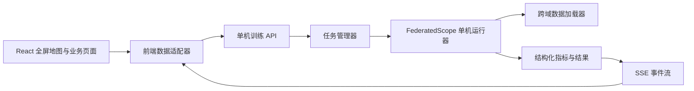

# 前端全屏地图与前后端联调——下一阶段优化设计

## 1. 文档目的

本文档定义当前前端进入下一阶段后的改版目标、默认数据域、全屏地图首页、60 客户端展示策略、隐藏式导航、前后端数据契约、文件规划和验收标准。

本阶段只完成设计，不修改现有代码。后续实施以本文档为依据。

## 2. 本轮确定的产品决策

1. 默认数据场景从抽象军事业务域调整为 OfficeHome 风格的跨域图像数据场景。
2. 默认包含 4 个数据域，每个域 15 个逻辑客户端，共 60 个客户端。
3. 首页只保留全屏地图及地图内部必要的状态覆盖层，不再显示指标卡、趋势图、节点表和右侧摘要栏。
4. 首页隐藏左侧导航和常规顶部栏，使地图真正覆盖整个浏览器可视区域。
5. 导航改为按需唤出的浮层，不再永久挤占地图宽度。
6. 地图继续使用 `resource/4o28b0625501ad13015501ad2bfc0135.jpg`。
7. 地图上的位置只是逻辑展示锚点，不能解释为数据采集地或真实节点部署位置。
8. 后端继续采用单机进程模拟服务端和逻辑客户端，不实现真实分布式网络。
9. 后端提供真实训练状态和指标；域子服务器与两级链路仍由前端根据数据域进行态势投影。
10. 隐私实验与后门实验继续保持互斥。

## 3. 默认跨域数据场景

### 3.1 OfficeHome 四域命名

默认场景名称建议使用“OfficeHome 跨域视觉协同”。四个域直接采用数据集语义，不再使用态势感知域、电磁感知域等与数据内容不一致的名称。

| 后端域键 | 中文展示名 | 英文短名 | 数据视觉特征 | 地图展示锚点 | 子服务器编号 | 客户端编号范围 |
| --- | --- | --- | --- | --- | --- | --- |
| `Art` | 艺术图像域 | Art | 绘画、艺术化表达、纹理与色彩风格明显 | 西北区域 | `OH-AS-01` | `OH-A-C01`～`OH-A-C15` |
| `Clipart` | 剪贴图域 | Clipart | 轮廓清晰、背景简化、图形化表达 | 北部区域 | `OH-CS-02` | `OH-C-C01`～`OH-C-C15` |
| `Product` | 商品图像域 | Product | 主体居中、背景干净、标准化拍摄 | 中部区域 | `OH-PS-03` | `OH-P-C01`～`OH-P-C15` |
| `Real_World` | 真实场景域 | Real World | 自然拍摄、背景复杂、光照和视角变化明显 | 东部沿海区域 | `OH-RS-04` | `OH-R-C01`～`OH-R-C15` |

地图主标签只显示“艺术图像域、剪贴图域、商品图像域、真实场景域”。“西北、北部、中部、东部沿海”只用于描述页面布局位置，不作为数据域名称。

地图底部或帮助提示固定说明：

> 地图位置为逻辑展示布局，不表示数据来源、真实地理分布或设备部署位置。

### 3.2 数据集信息

默认 OfficeHome 场景由后端返回以下元数据：

- 数据集标识：`office-home`。
- 四个数据域：`Art`、`Clipart`、`Product`、`Real_World`。
- 公共类别数量：由后端数据加载器返回，当前实现为 65 类。
- 数据划分：训练集、验证集和测试集。
- 每域客户端数量：15。
- 总客户端数量：60。
- 客户端划分随机种子：由实验配置指定。
- 域内分布方式：均衡、长尾或基于浓度参数的不均衡划分。

前端不得把类别数量、样本总量或客户端样本量写死。演示模式可以使用固定种子生成相同结构，联调模式必须采用后端返回的真实元数据。

### 3.3 每域 15 客户端的模拟规则

每个数据域包含 15 个逻辑客户端。地图不同时显示 60 个完整卡片，而是使用紧凑节点标记。

每个客户端至少包含：

| 字段 | 用途 |
| --- | --- |
| `clientId` | 稳定且全局唯一的逻辑客户端编号 |
| `domainKey` | 对应 OfficeHome 数据域 |
| `sampleCount` | 客户端训练样本量 |
| `classHistogram` | 客户端类别分布 |
| `status` | 等待、接收、训练、上传、完成、失败或过滤 |
| `progress` | 当前阶段进度 |
| `round` | 当前训练轮次 |
| `latencyMs` | 前端展示或后端统计的处理耗时 |
| `riskScore` | 安全实验中的风险分数 |
| `defenseAssessment` | 正常、疑似或过滤 |
| `maliciousGroundTruth` | 后门模拟中的角色真值 |
| `source` | `backend` 或 `frontend_simulation` |

默认状态构成建议：

- 训练中：每域 5～7 个。
- 等待或接收中：每域 3～5 个。
- 上传中：每域 2～4 个。
- 异常、失败或过滤：仅在对应演示场景中生成。
- 恶意节点：仅在后门实验中生成，默认总数不超过 60 个客户端的 10%。

隐私攻击的目标客户端不能显示为恶意客户端。

### 3.4 域内分布异构

OfficeHome 的四个域表达域间视觉风格差异；每个域内部的 15 个客户端继续模拟数据分布不均。

域内异构至少支持：

- 客户端样本量长尾。
- 类别比例不均衡。
- 部分类别缺失。
- 类别覆盖率不同。
- 数据质量和有效样本比例不同。

场景配置需要将“域间风格差异”和“域内标签分布不均”分开设置，避免把两者合并成一个异构强度。

### 3.5 其他跨域数据集预设

首页默认使用 OfficeHome，但数据模型不能限定为四个固定域。后续可从后端能力接口加载：

| 数据集预设 | 域展示名 |
| --- | --- |
| OfficeHome | 艺术图像域、剪贴图域、商品图像域、真实场景域 |
| PACS | 自然照片域、艺术绘画域、卡通图像域、素描图像域 |
| DomainNet | 剪贴图域、信息图域、绘画域、速写域、真实图像域、草图域 |

当数据域数量变化时，地图布局器应自动选择 3～6 个区域模板，不能依赖 `D01`～`D04` 的固定数组下标。

## 4. 全屏地图首页

### 4.1 首页定位

首页从“仪表盘”调整为“沉浸式全域地图封面”。除地图本身、服务器、节点、通信链路和必要控制外，不出现其他页面内容。

需要从首页移除：

- 页面标题和副标题区域。
- 全域感知到智能协同的流程带。
- 六个指标卡。
- 域级汇聚右侧栏。
- 两层异构摘要卡。
- 底部训练趋势图。
- 底部节点表。
- 固定左侧导航。
- 常规顶部栏。

这些功能不删除，分别保留在运行监控、异构分析、对照分析和节点详情中。

### 4.2 首屏尺寸

首页根节点使用独立沉浸式布局：

```text
position: fixed
inset: 0
width: 100vw
height: 100dvh
overflow: hidden
```

地图铺满整个可视区域，不受应用内容区宽度、页面内边距或侧栏宽度影响。

地图底图建议使用以下策略：

- 桌面端使用 `cover` 填满屏幕。
- 初始焦点放在地图主体中心，允许裁掉原图的图例和大面积空白。
- 提供平移、缩放和“一键复位”。
- 缩放范围建议为 `0.9～2.5`。
- 浏览器尺寸变化时重新计算服务器和客户端屏幕坐标。
- 地图覆盖层和底图共用同一个变换矩阵，避免缩放后节点漂移。

### 4.3 首页线框

```text
┌──────────────────────────────────────────────────────────────┐
│ [导航触发]                                      [状态/图例]  │
│                                                              │
│       ╭──────────────╮             ╭──────────────╮          │
│       │  艺术图像域   │             │  剪贴图域     │          │
│       │ 子服务器+15点 │             │ 子服务器+15点 │          │
│       ╰──────┬───────╯             ╰──────┬───────╯          │
│              ╲                             ╱                   │
│               ╲       中央主服务器        ╱                    │
│                ╲         CS-00           ╱                     │
│                 ╲          │            ╱                      │
│       ╭──────────┴───╮     │     ╭─────┴────────╮             │
│       │  商品图像域   │     │     │ 真实场景域    │             │
│       │ 子服务器+15点 │     │     │ 子服务器+15点 │             │
│       ╰──────────────╯           ╰──────────────╯             │
│                                                              │
│ [阶段：中央下发 → 域内广播 → 节点处理 → 上传 → 聚合] [缩放] │
└──────────────────────────────────────────────────────────────┘
```

地图覆盖层可以有浮动状态条，但不得重新形成大面积面板或遮挡地图。

### 4.4 四个大区域

区域圈需要比当前实现更大，四个区域合计覆盖地图主体的大部分面积。

建议使用相对地图容器的百分比坐标：

| 域 | 中心点参考 | 横向直径 | 纵向直径 | 布局要求 |
| --- | --- | --- | --- | --- |
| 艺术图像域 | `22%, 31%` | 34% | 36% | 左上大区域 |
| 剪贴图域 | `70%, 27%` | 32% | 34% | 右上大区域 |
| 商品图像域 | `43%, 69%` | 36% | 38% | 左下或中下大区域 |
| 真实场景域 | `79%, 67%` | 34% | 42% | 东部沿海大区域 |

实际实施时应在 1440×900、1600×1000、1920×1080 三种尺寸下微调，保证：

- 区域边界不超出主要地图轮廓过多。
- 四个区域彼此可以轻微重叠，但域子服务器不能重叠。
- 中央主服务器位于四个区域之间。
- 区域标题不与服务器或客户端重叠。
- 地图名称、行政文字只是背景，不影响前端域标签识别。

### 4.5 60 客户端的地图密度

每个区域 15 个客户端不能沿用五节点时的手工坐标。需要使用“约束式环形分布器”：

1. 以域子服务器为中心生成两层或三层椭圆轨道。
2. 第一层放置 5 个客户端。
3. 第二层放置 10 个客户端。
4. 使用固定种子生成角度抖动，避免所有域看起来完全相同。
5. 对区域标题、域子服务器和中央服务器建立避让矩形。
6. 相邻节点最小屏幕距离建议不小于 22px。
7. 浏览器尺寸变化时重新布局，但相同尺寸和种子必须得到相同位置。

节点显示按缩放级别分层：

| 地图缩放级别 | 节点显示 |
| --- | --- |
| 全图 | 仅显示状态圆点和每域状态计数，不显示全部编号 |
| 区域聚焦 | 显示 15 个节点短编号、状态和上传动画 |
| 节点聚焦 | 显示完整编号、样本量、风险和防御判断 |

节点悬停显示轻量提示；点击后使用右侧浮层展示详情。详情浮层覆盖在地图之上，不压缩地图宽度。

### 4.6 主服务器和域子服务器

中央主服务器：

- 固定在四个区域之间的中心位置。
- 显示全局轮次、当前阶段和已完成域数量。
- 下发时向四个域子服务器产生放射状动画。
- 上行时等待四个域子服务器完成后再进入全域聚合动画。
- 标签使用“中央主服务器”，编号使用 `CS-00`。

域子服务器：

- 每个数据域恰好一个。
- 显示域名、客户端完成数量和模拟域内汇聚进度。
- 编号使用 OfficeHome 域前缀。
- 必须持续显示“前端层级投影”提示。
- 后端没有真实域子服务器时，不得显示为后端真实计算节点。

### 4.7 地图阶段动画

阶段仍保持：

```text
中央下发 → 域内广播 → 客户端处理 → 客户端上传
→ 域内态势汇聚 → 域级上传 → 全域态势汇聚
```

动画规则：

- 只突出当前阶段相关链路。
- 60 个客户端的动画分批触发，避免同时闪烁。
- 每域最多同时显示 5 条高亮客户端链路，其余用域级进度表达。
- 开启“减少动态效果”后，使用静态方向箭头和进度颜色。
- 后端轮次推进时，前端阶段动画不得阻塞真实状态更新。

## 5. 隐藏式导航设计

### 5.1 首页导航

首页默认完全隐藏左侧导航和顶部栏。

导航入口采用以下组合：

- 左上角保留一个 36×36px 的半透明菜单按钮。
- 鼠标移动到屏幕左侧 8px 热区时显示按钮。
- 键盘快捷键 `M` 打开导航，`Esc` 关闭导航。
- 点击按钮后，导航以覆盖层形式从左侧滑入。
- 导航展开时地图不缩放、不位移。
- 选择页面后自动收起导航。

首次使用时可以短暂显示“菜单”文字，3 秒后收为图标，避免用户找不到入口。

### 5.2 其他页面导航

场景编排、异构分析、实验配置、运行监控、隐私攻击效果、对照分析、实验报告和设置页面继续使用应用框架，但导航默认采用 56px 窄栏。

用户可以：

- 点击图标展开完整导航。
- 固定展开状态。
- 返回首页时自动进入沉浸式隐藏状态。
- 使用浏览器返回键保持正确的页面路由。

### 5.3 页面壳层模式

`AppShell` 需要支持两种模式：

```ts
type ShellMode = 'immersive-map' | 'workspace';
```

- `/overview` 使用 `immersive-map`。
- 其他路由使用 `workspace`。
- 壳层模式由路由元数据决定，页面组件不能自行操作侧栏宽度。

## 6. 首页交互

### 6.1 默认状态

进入首页后：

1. 地图立即铺满屏幕。
2. 四个域边界和中央主服务器先出现。
3. 15 个客户端按域分批出现。
4. 数据加载完成后启动当前轮次动画。
5. 没有后端连接时显示“演示数据”小角标。
6. 后端连接成功后显示“训练数据”小角标。

### 6.2 域交互

点击域边界或域子服务器：

- 地图平滑放大并居中该域。
- 展示该域 15 个客户端完整状态。
- 显示域内类别分布和样本量摘要浮层。
- 再次点击空白或按 `Esc` 恢复全图。

### 6.3 客户端交互

点击客户端：

- 打开客户端详情浮层。
- 展示客户端编号、域、样本数、类别分布、轮次和状态。
- 隐私实验展示保护参数和攻击效果摘要。
- 后门实验展示风险分数和防御判断。
- 只有打开“模拟真值”后才展示恶意角色。

### 6.4 浮动控制

首页只保留以下必要控制：

- 导航按钮。
- 数据源状态。
- 当前轮次与阶段。
- 暂停或继续动画。
- 显示模拟真值开关。
- 地图缩放与复位。
- 图例。

控制条需要自动降低透明度，鼠标靠近时恢复，避免遮挡地图。

## 7. 前端数据模型调整

现有 `DomainKey` 是四个固定业务域的联合类型，需要改为可扩展字符串。

```ts
type DatasetKey = 'office-home' | 'pacs' | 'domainnet' | string;
type DataDomainKey = string;

interface DatasetPreset {
  key: DatasetKey;
  displayName: string;
  classCount: number;
  domains: DataDomainDefinition[];
  defaultClientsPerDomain: number;
}

interface DataDomainDefinition {
  key: DataDomainKey;
  displayName: string;
  shortName: string;
  visualDescription: string;
  color: string;
  serverId: string;
  mapAnchorId: string;
}

interface MapAnchor {
  id: string;
  center: { x: number; y: number };
  radius: { x: number; y: number };
  server: { x: number; y: number };
  label: { x: number; y: number };
  seed: number;
}

interface ClientRuntimeState {
  clientId: string;
  domainKey: DataDomainKey;
  status: NodeOperationalStatus;
  stage: TrainingStage;
  round: number;
  progress: number;
  sampleCount: number;
  classHistogram: Record<string, number>;
  riskScore?: number;
  defenseAssessment?: DefenseAssessment;
  maliciousGroundTruth?: boolean;
  source: 'backend' | 'frontend_simulation';
  updatedAt: string;
}
```

数据域定义和地图锚点必须分离。这样更换 PACS 或 DomainNet 时，只需要重新绑定地图位置，不需要修改训练数据语义。

## 8. 前后端联调目标

下一阶段的联调目标是让前端读取真实的单机训练状态，而不是让后端实现地图或真实分层服务器。

### 8.1 职责边界

后端负责：

- 加载 OfficeHome、PACS 或 DomainNet。
- 将每个数据域划分为指定数量的逻辑客户端。
- 启动单机联邦训练。
- 执行异构解决、隐私保护或后门攻防实验。
- 输出阶段、轮次、客户端状态、指标和防御决策。
- 管理任务启动、暂停、恢复、取消和结果文件。

前端负责：

- 把数据域绑定到地图展示区域。
- 生成域子服务器的展示对象。
- 将 60 个客户端布置到四个区域。
- 将扁平训练事件投影成两级汇聚和逐级下发动画。
- 展示后端真实指标和前端模拟阶段。
- 对每一项派生数据标记来源。

### 8.2 联调架构



后端建议采用轻量 HTTP API 加 SSE。控制请求使用 HTTP，持续训练事件使用 SSE；当前没有双向高频通信需求，不必优先引入 WebSocket。

## 9. 后端接口设计

### 9.1 能力和数据集

| 方法 | 路径 | 用途 |
| --- | --- | --- |
| `GET` | `/api/capabilities` | 查询支持的实验模式、攻击类别和参数范围 |
| `GET` | `/api/datasets` | 查询可用跨域数据集 |
| `GET` | `/api/datasets/:key/metadata` | 查询域、类别、样本量和可用划分 |
| `POST` | `/api/scenarios/preview` | 预览 4 域 × 15 客户端的数据划分 |

`GET /api/datasets/office-home/metadata` 示例：

```json
{
  "data": {
    "key": "office-home",
    "displayName": "OfficeHome",
    "classCount": 65,
    "domains": [
      { "key": "Art", "displayName": "艺术图像域", "sampleCount": 0 },
      { "key": "Clipart", "displayName": "剪贴图域", "sampleCount": 0 },
      { "key": "Product", "displayName": "商品图像域", "sampleCount": 0 },
      { "key": "Real_World", "displayName": "真实场景域", "sampleCount": 0 }
    ],
    "defaultClientsPerDomain": 15
  },
  "requestId": "req-001",
  "timestamp": "2026-08-15T08:00:00Z"
}
```

示例中的 `sampleCount` 必须由后端扫描数据目录后填写，前端不能假设固定值。

### 9.2 实验控制

| 方法 | 路径 | 用途 |
| --- | --- | --- |
| `POST` | `/api/experiments` | 创建并启动实验 |
| `GET` | `/api/experiments/:id` | 获取配置和最新状态 |
| `POST` | `/api/experiments/:id/pause` | 请求暂停 |
| `POST` | `/api/experiments/:id/resume` | 恢复任务 |
| `POST` | `/api/experiments/:id/cancel` | 取消任务 |
| `GET` | `/api/experiments/:id/snapshot` | 获取完整状态快照 |
| `GET` | `/api/experiments/:id/events` | 订阅 SSE 事件 |
| `GET` | `/api/experiments/:id/results` | 获取完成后的结构化结果 |

创建 OfficeHome 实验的前端语义请求：

```json
{
  "scenario": {
    "dataset": "office-home",
    "domains": ["Art", "Clipart", "Product", "Real_World"],
    "clientsPerDomain": 15,
    "partition": {
      "strategy": "dirichlet",
      "concentration": 0.3,
      "minSamplesPerClient": 10,
      "seed": 20260815
    }
  },
  "training": {
    "rounds": 30,
    "sampledClientsPerRound": 24,
    "localEpochs": 2
  },
  "mode": "backdoor",
  "heterogeneitySolution": {
    "enabled": true,
    "featureStageEnabled": true,
    "trainingStageEnabled": true
  },
  "privacyProtection": null,
  "attack": {
    "enabled": true,
    "category": "backdoor",
    "maliciousClientIds": ["OH-A-C04", "OH-R-C11"]
  },
  "defense": {
    "featureStageEnabled": true,
    "trainingStageEnabled": true
  }
}
```

接口校验必须拒绝同时出现隐私攻击与后门攻击的请求。

### 9.3 SSE 事件信封

```ts
interface TrainingEvent<T = unknown> {
  id: string;
  sequence: number;
  experimentId: string;
  type: TrainingEventType;
  timestamp: string;
  source: 'backend';
  payload: T;
}

type TrainingEventType =
  | 'experiment.started'
  | 'stage.changed'
  | 'round.started'
  | 'client.sampled'
  | 'client.status.changed'
  | 'client.metric.updated'
  | 'client.upload.completed'
  | 'defense.decision.created'
  | 'round.completed'
  | 'privacy.result.updated'
  | 'experiment.completed'
  | 'experiment.failed';
```

客户端状态事件示例：

```json
{
  "id": "evt-01984",
  "sequence": 1984,
  "experimentId": "exp-officehome-001",
  "type": "client.status.changed",
  "timestamp": "2026-08-15T08:12:31Z",
  "source": "backend",
  "payload": {
    "clientId": "OH-P-C09",
    "domainKey": "Product",
    "round": 12,
    "stage": "federated_training",
    "status": "uploading",
    "progress": 72
  }
}
```

### 9.4 断流恢复

- SSE 事件必须具有递增 `sequence`。
- 前端保存最后一个成功处理的事件编号。
- 重连时通过 `Last-Event-ID` 请求缺失事件。
- 后端无法补发时，前端调用 `/snapshot` 获取完整状态。
- 快照版本低于当前前端状态时不得覆盖新状态。
- 同一个事件重复到达时必须保持幂等。

## 10. 后端任务模型

API 层建议创建独立任务管理模块，不直接在请求线程中运行训练。

```text
HTTP 请求
  → 参数校验
  → 语义配置转换
  → 创建任务目录
  → 启动单机训练子进程
  → 解析结构化事件
  → SSE 推送
  → 保存结果索引
```

任务状态：

```text
draft → queued → starting → running → paused → completed
                              ↘ failed / cancelled
```

暂停需要区分：

- `pause_requested`：已收到请求，当前训练步骤尚未到安全暂停点。
- `paused`：训练已暂停。

前端不能在收到暂停请求后立即伪造“已暂停”。

## 11. 真实指标与前端派生状态

### 11.1 必须由后端提供

- 数据集和域元数据。
- 60 个客户端的稳定编号与数据域归属。
- 客户端样本量和类别分布。
- 实验真实阶段和轮次。
- 客户端是否被本轮采样。
- 客户端训练、上传或失败状态。
- 全局、域级和客户端级指标。
- 隐私保护参数及效果结果。
- 攻击成功率、干净准确率和防御决策。
- 实验错误和最终输出位置。

### 11.2 可以由前端派生

- 域子服务器对象。
- 域内汇聚进度。
- 中央服务器与域子服务器之间的动画子阶段。
- 地图坐标。
- 未被后端记录的演示延迟。
- 区域节点避让和聚类状态。

所有派生字段必须包含：

```json
{
  "source": "frontend_simulation",
  "simulated": true
}
```

## 12. 前端状态管理

前端状态分为四层：

1. 服务器状态：能力、数据集、实验和事件流，使用查询缓存管理。
2. 训练快照：阶段、轮次、客户端状态和指标，使用标准化实体仓库。
3. 地图状态：缩放、平移、选中域、选中客户端和图层可见性。
4. 界面偏好：导航状态、动画偏好、真值开关和数据源模式。

训练事件不能直接修改地图坐标。地图布局变化也不能修改训练配置。

## 13. 建议文件调整

### 13.1 前端

```text
frontend/src/
├── app/
│   ├── AppShell.tsx
│   ├── ImmersiveMapShell.tsx
│   ├── WorkspaceShell.tsx
│   └── routeMeta.ts
├── api/
│   ├── client.ts
│   ├── capabilities.ts
│   ├── datasets.ts
│   ├── experiments.ts
│   └── eventStream.ts
├── components/map/
│   ├── FullScreenFederationMap.tsx
│   ├── MapViewport.tsx
│   ├── DomainRegion.tsx
│   ├── DomainServerMarker.tsx
│   ├── ClientMarkerLayer.tsx
│   ├── ClientMarker.tsx
│   ├── CentralServerMarker.tsx
│   ├── CommunicationLayer.tsx
│   ├── MapFloatingControls.tsx
│   ├── MapLegend.tsx
│   └── NavigationTrigger.tsx
├── features/overview/
│   ├── OverviewPage.tsx
│   ├── DomainFocusOverlay.tsx
│   ├── ClientDetailOverlay.tsx
│   └── useMapProjection.ts
├── mock/
│   ├── presets/officeHome.ts
│   ├── presets/pacs.ts
│   ├── presets/domainNet.ts
│   └── generators/clientRuntime.ts
├── stores/
│   ├── experimentStore.ts
│   ├── mapStore.ts
│   └── preferenceStore.ts
├── types/
│   ├── dataset.ts
│   ├── experiment.ts
│   ├── events.ts
│   └── map.ts
└── utils/
    ├── clientLayout.ts
    ├── hierarchyProjection.ts
    └── eventReducer.ts
```

现有 `FederationTopology.tsx` 应拆分，不再继续堆积地图、节点、服务器和连线逻辑。

### 13.2 后端

```text
federatedscope/standalone_api/
├── __init__.py
├── app.py
├── schemas.py
├── capabilities.py
├── config_adapter.py
├── task_manager.py
├── event_bus.py
├── log_parser.py
├── result_reader.py
└── routes/
    ├── datasets.py
    ├── experiments.py
    └── events.py
```

后端优先复用：

- `federatedscope/cv/dataset/office_home.py`
- `federatedscope/cv/dataset/pacs.py`
- `federatedscope/cv/dataset/domainnet.py`
- `run.py`
- `scripts/standalone_configs/` 中的功能配置模板

API 层不能把前端字段直接拼接到命令行。所有配置字段必须经过白名单、类型和范围校验。

## 14. 开发与联调环境

后端运行和测试使用：

```text
/root/.local/share/mamba/envs/pfedba/bin/python
```

前端继续使用 Node、Vite 和 Playwright。

联调环境默认地址：

```text
前端：http://127.0.0.1:5173
后端：http://127.0.0.1:8000
```

本地开发由 Vite 代理 `/api`，避免在代码中写死后端主机地址。

## 15. 性能设计

60 个客户端对地图渲染提出以下要求：

- 客户端节点使用单一图层渲染，避免每个节点创建复杂图表。
- 全图状态下不渲染 60 个常驻文本标签。
- 高频事件按动画帧批量写入状态。
- 客户端进度变化的视觉刷新不高于每秒 10 次。
- 地图平移和缩放期间暂停非必要链路动画。
- 类别分布只在详情浮层中加载。
- 地图背景图片进行浏览器友好的格式和尺寸优化，但保留原始资源。
- 首页首个可交互目标不高于 2 秒，地图覆盖层稳定不高于 3 秒。
- 页面后台运行时暂停动画，仍接收并合并最新事件。

## 16. 实施顺序

### 阶段一：数据域和全屏首页重构

- 将默认域替换为 OfficeHome 四域。
- 将客户端数量改为每域 15 个。
- 把首页改为独立全屏地图壳层。
- 删除首页非地图内容。
- 实现隐藏式导航。
- 实现 60 客户端约束式地图布局。
- 拆分地图组件和状态。

### 阶段二：前端数据适配层

- 定义数据集、实验、快照和事件类型。
- 建立演示数据适配器和后端适配器。
- 实现 SSE 事件归并与断流恢复。
- 为所有真实和派生字段增加来源标识。
- 保证无后端时仍可运行完整演示。

### 阶段三：后端轻量 API

- 实现能力和数据集元数据接口。
- 实现场景预览和 4 域 × 15 客户端划分。
- 实现实验任务管理。
- 将单机训练状态转换为结构化事件。
- 实现任务控制、快照和结果读取。

### 阶段四：安全实验联调

- 联调异构处理两阶段状态。
- 联调本地隐私保护及三类隐私攻击结果。
- 联调后门攻击、恶意真值和两阶段防御结果。
- 验证隐私实验与后门实验不会并行启用。

### 阶段五：性能和稳定性

- 对 60 个客户端进行持续事件压力测试。
- 优化地图重绘和事件合并。
- 完成长实验断流重连和页面刷新恢复。
- 验证报告结果与后端输出一致。

## 17. 测试计划

### 17.1 前端单元测试

- OfficeHome 四域名称和后端域键映射。
- 每域恰好生成 15 个客户端。
- 60 个客户端编号全局唯一。
- 客户端布局具有确定性且不超出区域边界。
- 地图布局器能处理 3～6 个数据域。
- 隐私与后门模式互斥。
- 事件归并、重复事件和乱序事件处理。
- SSE 断流后的快照恢复。
- 后端字段与前端派生字段来源标识。

### 17.2 浏览器测试

- 首页首次进入不显示侧栏和常规顶部栏。
- 地图覆盖 `100vw × 100dvh`。
- 左侧热区、菜单按钮和快捷键可以打开导航。
- 导航浮层打开时地图尺寸不变化。
- 四个 OfficeHome 域均可见。
- 每个域存在一个域子服务器和 15 个客户端。
- 点击域能够聚焦并显示 15 个客户端。
- 点击客户端能够打开详情浮层。
- 恶意真值关闭后不在 DOM 和无障碍文本中泄露。
- 1440×900、1600×1000、1920×1080 下无关键标注重叠。

### 17.3 后端测试

- 使用 OfficeHome 加载器发现四个域。
- 相同随机种子产生相同客户端划分。
- 每域 15 个客户端且没有样本错误归域。
- 请求参数白名单和目录安全校验。
- 实验创建、运行、暂停、恢复和取消。
- SSE 事件序号严格递增。
- 任务失败能够返回结构化错误。
- 训练结束后结果可以通过接口读取。

### 17.4 联调测试

- 使用 `/root/.local/share/mamba/envs/pfedba/bin/python` 启动后端。
- 前端读取真实 OfficeHome 元数据。
- 地图显示真实 60 客户端编号和样本数。
- 后端轮次推进能够驱动地图状态变化。
- 页面刷新后能够恢复当前实验。
- 后端停止时前端显示断连但保留最后状态。
- 演示数据和真实数据不会混在同一个实验记录中。

## 18. 验收标准

下一阶段完成需要同时满足：

- 首页只有全屏地图和地图必要覆盖层。
- 左侧导航默认隐藏并可以可靠唤出。
- 默认域名为艺术图像域、剪贴图域、商品图像域和真实场景域。
- 地图四个域圈选范围明显大于当前版本。
- 每个域显示一个域子服务器和 15 个客户端。
- 中央主服务器位于地图中心区域。
- 地图缩放或窗口变化后节点不会漂移出域。
- 默认演示模式可以离线运行。
- 联调模式能够读取后端真实数据集、客户端、轮次和安全结果。
- 域子服务器与分层汇聚明确标记为前端投影。
- 隐私攻击与后门攻击不能同时运行。
- 60 客户端持续更新时页面无明显卡顿。
- 前端单元测试、浏览器测试、后端测试和联调测试全部通过。

## 19. 明确不做

- 不把 OfficeHome 四个数据域解释为真实地理区域。
- 不实现真实分布式客户端或真实域子服务器。
- 不把客户端原始图片上传到前端。
- 不在首页重新增加大面积统计面板。
- 不为了展示分层动画修改后端聚合算法。
- 不在同一次实验中同时执行隐私攻击和后门攻击。
- 不在前端暴露数据集绝对路径、服务器文件路径或可执行命令。
